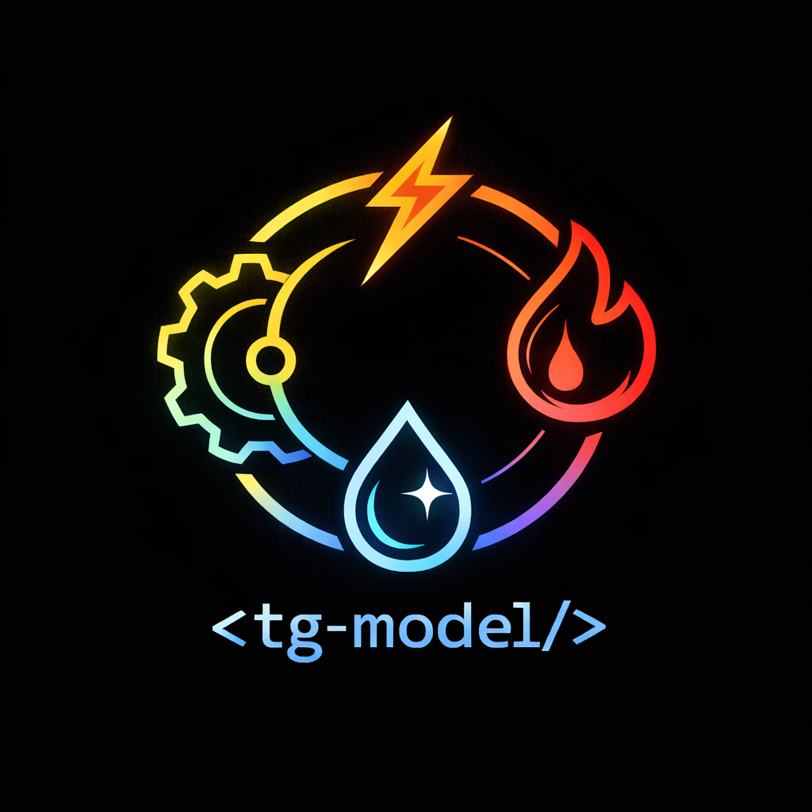

<div align="center">



# thundergraph-model

**Executable systems modeling in Python** — architecture, constraints, behavior, and traceability in one library engineers can actually run.

[](https://www.python.org/downloads/)
[](./LICENSE)
[](./tests/)
[](#development)
[](https://docs.astral.sh/ruff/)
[](https://mypy-lang.org/)
[](https://hatch.pypa.io/)
[](https://docs.astral.sh/uv/)

[Quick start](#quick-start) · [Why this exists](#why-this-exists) · [Examples](#examples-in-this-repo) · [Docs](#documentation) · [Development](#development)

</div>

---

## Why this exists

Most “architecture” tools stop at diagrams. **ThunderGraph Model** is a **small, strict Python library** for modeling **systems** the way engineers think: **parts**, **interfaces**, **constraints**, **requirements with acceptance**, **nested requirement structures**, **discrete behavior**, and **provenance** — all tied together so you can **compile**, **evaluate**, and **validate** a configuration, not just draw it.

It is built for **MBSE**-style workflows, **digital twin** sketches, and **executable specs** where **units matter** (`unitflow`), **requirements are the locus of acceptance**, and **citations** attach to real design elements for traceability. **External compute** can hydrate discipline outputs (`attribute(..., computed_by=...)`) while the graph keeps dependencies explicit.

If you want a library that feels **honest** (fail-fast validation, explicit graphs) and **hackable** (plain Python, no proprietary runtime), you’re in the right place.

---

## What you get

| Capability | What it means for engineering |
|------------|--------------------------------|
| **Structured authoring** | `System` / `Part` / `RequirementBlock` with `define(cls, model)` — declare ports, parameters, attributes, constraints, behavior, and **nested requirement blocks** in one place. |
| **Unit-aware expressions** | Parameters and attributes use **unitflow**; constraints and requirement acceptance evaluate on real quantities. |
| **Requirements + allocation** | Requirements can live in **nested** `RequirementBlock` trees (dot-path refs). `allocate` links them to **parts** or the configured root; optional **`requirement_input` / `requirement_accept_expr`** plus **`allocate(..., inputs={...})`** bind part values into acceptance without globals. |
| **Cross-hierarchy parameters** | **`parameter_ref(RootType, "param_name")`** lets nested `define()` bodies read scenario or program parameters in a compile-safe way. |
| **External computation** | **`ExternalComputeBinding`**, **`attribute(computed_by=...)`**, and graph compilation wire fake or real tools into the same `Evaluator` pipeline as expressions and constraints. |
| **Citations & references** | `citation` nodes and `references` edges bind standards, reports, or clauses to declared elements — provenance without pretending to be a bibliography manager. |
| **Discrete behavior** | States, events, guards, sequences, fork/join, item flow across ports — **scenarios** for trace validation. |
| **Execution** | `instantiate` / `System.instantiate()` → optional `compile_graph` → `ConfiguredModel.evaluate(inputs={slot: Quantity(...)})` **or** explicit `Evaluator` + `RunContext` — same pipeline under the hood. |

---

## Quick start

This directory is its **own [uv](https://docs.astral.sh/uv/) project** (separate from the monorepo root venv).

```bash
cd thundergraph-model
uv sync --all-groups       # dev group: pytest, ruff, mypy, nbconvert/ipykernel, …
uv run pytest              # includes coverage on tg_model (see pyproject.toml)
uv run pytest --no-cov     # faster when you do not need a coverage report
uv run ruff check tg_model tests
uv run mypy tg_model
```

---

## Examples in this repo

The **installable wheel** only contains **`tg_model`**. Larger **walkthroughs** live beside it:

| Location | What it is |
|----------|------------|
| [`examples/commercial_aircraft/`](examples/commercial_aircraft/) | Requirements-first cargo-jet slice: stdlib L1 specs, nested `RequirementBlock`, `allocate(inputs=…)`, roll-ups, two external-compute owners, reporting extract/snapshot; **`ConfiguredModel.evaluate`** + **`ValueSlot`** keys for runs (see example [`README.md`](examples/commercial_aircraft/README.md)). Put **`thundergraph-model/examples`** on `PYTHONPATH` and `import commercial_aircraft`. |
| [`notebooks/`](notebooks/) | Jupyter demos (AEV, LEO stack, sodium fast reactor, cargo jet). |

**Notebook demos** (run from `thundergraph-model/` after `uv sync`; dev group includes `ipykernel` / `nbconvert`):

```bash
uv run jupyter lab notebooks/autonomous_electric_vehicle.ipynb
uv run jupyter lab notebooks/leo_launch_vehicle_deep_stack.ipynb
uv run jupyter lab notebooks/sodium_fast_reactor_demo.ipynb
uv run jupyter lab notebooks/cargo_jet_program.ipynb
```

Headless check:

```bash
uv run jupyter nbconvert --to notebook --execute notebooks/cargo_jet_program.ipynb --stdout > /dev/null
```

---

## Documentation

| Doc | Purpose |
|-----|---------|
| [`docs/user_docs/IMPLEMENTATION_PLAN.md`](docs/user_docs/IMPLEMENTATION_PLAN.md) | **Roadmap:** Sphinx HTML site, NumPy docstrings, user vs developer docs, hosting. |
| [`CHANGELOG.md`](CHANGELOG.md) | **Release notes** intent (e.g. evaluation façade, `System.instantiate`). |
| [`docs/generation_docs/v0_api.md`](docs/generation_docs/v0_api.md) | Internal design / agent-oriented API draft (not the public manual). |
| [`docs/generation_docs/implementation_plan.md`](docs/generation_docs/implementation_plan.md) | Historical phased roadmap for library development. |
| [`docs/generation_docs/logical_architecture.md`](docs/generation_docs/logical_architecture.md) | Conceptual architecture. |
| [`examples/commercial_aircraft/IMPLEMENTATION_PLAN.md`](examples/commercial_aircraft/IMPLEMENTATION_PLAN.md) | Cargo example scope only (links to user-docs plan in §13). |

Build user docs HTML (Phase 3 scaffold):

```bash
uv sync --group docs
uv run sphinx-build -b html docs/user_docs docs/user_docs/_build/html
uv run sphinx-build -b html docs/user_docs docs/user_docs/_build/html -W   # warnings as errors (CI-style)
```

---

## Development

| Tool | Role |
|------|------|
| **pytest** + **pytest-cov** | **241** tests under [`tests/`](tests/): **`tests/unit/`** (model, execution, analysis, …) and **`tests/integration/`** (e2e evaluation, external compute, requirement acceptance, behavior, **commercial aircraft smoke**, structural demos). Default `addopts` run **`--cov=tg_model`**. |
| **Ruff** | Lint + import sort (`E`, `F`, `I`, `UP`, `RUF`). |
| **mypy** | **Strict** typing on `tg_model`. |
| **pyright** | Optional **Pylance-style** check; dev dependency. The evaluation façade (`ConfiguredModel.evaluate`, `System.instantiate`) is kept **pyright-clean**; full-package `pyright tg_model` may still report pre-existing issues elsewhere until cleaned up. |

Typical loop:

```bash
uv run pytest
uv run ruff check tg_model tests && uv run ruff format tg_model tests
uv run mypy tg_model
uv run pyright tg_model/execution/configured_model.py tg_model/model/elements.py
```

**Coverage** badge (~**87%** for `tg_model` with the current suite) comes from `uv run pytest`; re-run to refresh.

---

## License

Licensed under the **Apache License 2.0** — see [`LICENSE`](./LICENSE).

---

## Contributing

Issues and PRs are welcome. Keep changes focused, match existing style (`ruff` / `mypy`), and extend **tests** when you touch behavior or contracts — prefer **unit** tests for isolated rules and **integration** tests for compile → instantiate → evaluate paths.

If you want to **talk engineering** about MBSE, nuclear, automotive, or digital twins — this library is meant to be **used**, not just read.
