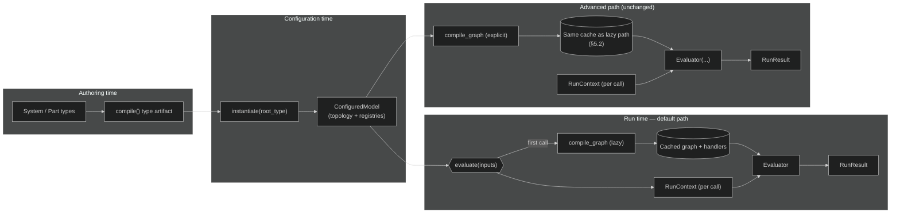

# Implementation plan — evaluation API facade (`instantiate` → `evaluate`)

**Status:** Draft for review  
**Audience:** Implementers, reviewers, and documentation owners  
**Related instructions:** Repository root [`implementation_plan_instructions.md`](../../../implementation_plan_instructions.md) (structure, gates, test-plan expectations).

This plan introduces a **default, low-ceremony execution path** for configured models: **lazy compilation** on first evaluation, **`evaluate(inputs=…)`** on the configured instance, and **handle-based inputs** (e.g. `ValueSlot` keys) so users are not required to thread **`RunContext`**, **`Evaluator`**, or raw **`stable_id`** strings for routine workflows. The existing **explicit pipeline** remains available for advanced users and tooling.

---

## Table of contents

1. [Purpose and scope](#1-purpose-and-scope)
2. [Design philosophy](#2-design-philosophy)
3. [Methodology](#3-methodology)
4. [Goals and non-goals](#4-goals-and-non-goals)
5. [Technical approach (decisions)](#5-technical-approach-decisions)
   - [Return value (Phase 1)](#51-return-value-phase-1)
   - [Cache coherence (explicit vs lazy compile)](#52-cache-coherence-explicit-vs-lazy-compile)
   - [Failure and exception contract](#53-failure-and-exception-contract)
   - [Synchronous-only scope for Phase 1](#54-synchronous-only-scope-for-phase-1)
   - [Serialization, copy, and process boundaries](#55-serialization-copy-and-process-boundaries)
6. [Architecture](#6-architecture)
   - [Conceptual flow (Mermaid, dark)](#61-conceptual-flow-mermaid-dark)
   - [Compatibility with the explicit pipeline](#62-compatibility-with-the-explicit-pipeline)
7. [File tree architecture](#7-file-tree-architecture)
8. [Phased delivery and GO / NO-GO gates](#8-phased-delivery-and-go--no-go-gates)
9. [Test plan](#9-test-plan)
10. [Risks and mitigations](#10-risks-and-mitigations)
11. [Documentation and examples phases (post-implementation)](#11-documentation-and-examples-phases-post-implementation)
12. [References](#12-references)

---

## 1. Purpose and scope

**Purpose:** Reduce cognitive load for **standard** library users while preserving **transparent, SOLID-aligned** internals: one obvious way to run a configured model after instantiation, **without** forcing users to assemble compilation, evaluation, and context objects for every notebook or script.

**In scope:**

- **`ConfiguredModel.evaluate(...)`** (name finalizable during implementation) that:
  - Performs **lazy** `compile_graph` (and caches the compiled graph and handler map) on first use.
  - Accepts **inputs** keyed by **topology handles** (at minimum **`ValueSlot`** instances belonging to the model), normalized internally to the engine’s existing **`stable_id`**-keyed input contract.
  - Uses a **fresh `RunContext` per evaluation** unless an advanced option explicitly supplies one (product decision in Phase 1).
- **`System.instantiate()`** (or equivalent **`Element`**-level class method) as an ergonomic alias for today’s **`instantiate(RootType)`** module function, without breaking existing call sites.
- **Explicit policy** for **`validate_graph`** relative to the first `evaluate` (run automatically, opt-in, or separate `validate()` only).
- **Backward compatibility:** `compile_graph` → `Evaluator` → `RunContext` remains supported and documented as the **advanced** path.

**Out of scope (unless a later phase explicitly rescopes):**

- Removing **`stable_id`** from the engine or storage layers.
- Automatic **code generation** of per-system subclasses solely for typing ergonomics.
- Changing **unit** or **Quantity** semantics; **`Quantity`** remains the user-facing value type in examples and APIs.
- A facade for **`evaluate_async`** in Phase 1 (see [§5.4](#54-synchronous-only-scope-for-phase-1)); the explicit async pipeline remains available to advanced users.

---

## 2. Design philosophy

ThunderGraph engineering values apply directly to this API work:

| Principle | How it shows up |
|-----------|------------------|
| **Simpler, more elegant, easier to understand** | One **default** story: instantiate → evaluate with **handles + Quantity**; hide compilation and context assembly until needed. |
| **SOLID** | **`ConfiguredModel`** remains the configured topology; **evaluation orchestration** is a thin façade delegating to **`compile_graph`**, **`Evaluator`**, and **`RunContext`**—not a new monolith subsystem. **Single responsibility:** normalization of input keys is one place; graph compilation stays in **`graph_compiler`**. |
| **Small, single-purpose functions** | Input normalization, cache lookup, and “build context + run” should be **short** helpers testable in isolation. |
| **Meet requirements** | GO gates are **testable** (tests + docs build + notebooks execute). |

---

## 3. Methodology

**Facade, not fork:** The public “simple” path **calls** existing compilation and evaluation primitives. Behavior should remain **observationally equivalent** to the manual pipeline when given equivalent inputs (modulo explicit validation timing if policy differs).

**Ground truth:** **Code + tests** define behavior; **docstrings** on new public methods are the API contract; **user docs** explain the mental model and when to use the advanced path.

**Incremental delivery:** Land **core library behavior** first with tests; then **documentation and examples** so external narratives do not lead the implementation.

**Naming review:** Resolve **`evaluate` vs `run`**, and **`System.instantiate` vs module `instantiate`**, early in Phase 1 to avoid churn in docs and examples.

---

## 4. Goals and non-goals

**Goals**

- Standard users can run: **`root = MySystem.instantiate()`** (or existing **`instantiate(MySystem)`**) then **`root.evaluate(inputs={ slot: Quantity(...) })`** without manual compile/context wiring.
- **Hierarchy-first ergonomics:** parameter and attribute **slots** on the instantiated tree are valid input keys where the graph expects inputs.
- **Lazy compile:** no mandatory separate **`.compile()`** for the default path; first **`evaluate`** triggers compilation once (cached).
- **Explicit path preserved** for debugging, custom runners, and async strategies.

**Non-goals**

- Replacing internal graph identity (`stable_id`) with only path strings everywhere in the engine.
- Promising thread-safe concurrent **`evaluate`** on a single instance **unless** explicitly designed and tested (document single-threaded default if not).

---

## 5. Technical approach (decisions)

Decisions below are **defaults for the plan**; adjust during implementation only with an explicit note in the PR and an update to this document.

| Topic | Decision |
|--------|-----------|
| Lazy compile cache owner | **`ConfiguredModel` instance** holds optional cached **`(DependencyGraph, handlers)`** (or a small private helper object), populated on first successful compile. |
| Input keys | **Primary:** `ValueSlot` (and document any additional **`HasStableId`**-style types accepted). **Optional compatibility:** `str` **`stable_id`** for scripts and interop. |
| `RunContext` lifetime | **New context per `evaluate`** by default; optional **`run_context=`** only for advanced/testing scenarios. |
| `validate_graph` | Choose one: **(A)** auto-run on first compile inside **`evaluate`**, **(B)** separate **`validate()`** on the model, or **(C)** validate only when flag **`validate=True`**. Pick before Phase 1 GO to avoid hypertension from surprise failures vs surprise skips. |
| `System.instantiate()` | **Classmethod** on **`System`** (or **`Element`**) that ensures type compilation and delegates to **`configured_model.instantiate(cls)`**. |
| Quantity / units | **Unchanged**; normalization only maps keys, not value types (beyond existing evaluator expectations). |
| Static typing | New public methods carry annotations; **pyright** (or project-standard type check) passes on touched modules as part of Phase 1 / 4 GO gates. |

### 5.1 Return value (Phase 1)

- **`evaluate`** returns **`RunResult`** (same aggregate type as **`Evaluator.evaluate`** today), so behavior and **`passed` / `failures` / `constraint_results`** remain familiar.
- Users **do not** need to construct or read **`RunContext`** for the default path; values needed for reporting can be read from **`RunResult`** and existing result surfaces **unless** a follow-up adds optional **output projection** (e.g. values by **`ValueSlot`**) in a later phase—**out of scope for Phase 1** unless explicitly added with its own GO gate.
- **Docstrings** must state clearly how to obtain **constraint / requirement outcomes** without exposing **`RunContext`** as a requirement for beginners.

### 5.2 Cache coherence (explicit vs lazy compile)

**Problem:** If **`compile_graph(model)`** and **`evaluate()`** use **different** cached artifacts, users pay **double compilation** or see **inconsistent** graphs.

**Rule (single source of truth):** **`ConfiguredModel`** owns **at most one** cached **`(DependencyGraph, compute_handlers)`** per instance. **Whichever runs first**—a successful **`compile_graph`** that **registers** into this cache, or the first **`evaluate`** that compiles—**populates** the cache; **all subsequent** **`evaluate`** calls and **explicit** **`Evaluator`** usage **reuse** the same tuple.

**Implementation note:** This may require **`compile_graph`** to **write through** to the model’s cache when passed a **`ConfiguredModel`**, or a single internal **`_ensure_compiled(model)`** used by both **`compile_graph`** and **`evaluate`**. The exact mechanism is an implementation detail; the **contract** is: **no duplicate compilation** on the hot path when mixing explicit compile and **`evaluate`** on the **same** instance.

### 5.3 Failure and exception contract

**Structural failures** (the model cannot be compiled or the graph cannot be validated as configured):

- **`GraphCompilationError`** and analogous **compile** failures: **`evaluate`** **re-raises** (or wraps in a single documented exception type) so callers see **failure to build** the run **distinct** from a completed run that **failed** constraints.
- **`validate_graph`** (when invoked per §5 policy): **failure** is **either** raised with a clear message **or** returned as a structured validation object—**pick one** and document; do **not** silently no-op.

**Runtime evaluation failures** (graph ran but inputs missing, external tool failed, constraint not satisfied):

- Continue to surface via **`RunResult.failures`**, **`RunResult.passed`**, and **`constraint_results`** as today.

This split avoids teaching users that “everything is in **`RunResult`**” when the engine never started.

### 5.4 Synchronous-only scope for Phase 1

- The **facade** **`evaluate`** is **synchronous** only in Phase 1.
- **`Evaluator.evaluate_async`** / async externals remain usable via the **explicit** pipeline; a future **`evaluate_async`** on **`ConfiguredModel`** is **not** part of Phase 1 deliverables and should be listed in **document history** or a follow-up if requested.

### 5.5 Serialization, copy, and process boundaries

- **Pickle / deep-copy** of a **`ConfiguredModel`** that holds a compiled graph is **unsupported** or **undefined** unless explicitly implemented and tested; **document** that cached graphs may be **invalid** after copy or must be **cleared** on **`__getstate__` / copy**.
- **Multi-process** workers must **not** assume a cached graph is portable; each process should **instantiate** (or accept a serialized **topology-only** artifact if added later).

---

## 6. Architecture

### 6.1 Conceptual flow (Mermaid, dark)



### 6.2 Compatibility with the explicit pipeline

The façade is a **thin layer**: **`compile_graph`**, **`DependencyGraph`**, **`Evaluator`**, and **`RunContext`** remain the composable building blocks. The plan **does not** remove or rename them; it adds a **recommended default** entry point on **`ConfiguredModel`** (and ergonomic **`System.instantiate`**).

---

## 7. File tree architecture

**Primary touchpoints (conceptual):**

```text
thundergraph-model/
├── tg_model/
│   ├── execution/
│   │   ├── configured_model.py      # ConfiguredModel.evaluate + lazy cache + input normalization
│   │   ├── evaluator.py             # Unchanged contract; façade calls into it
│   │   ├── graph_compiler.py        # Unchanged public compile_graph
│   │   └── run_context.py           # Unchanged; façade creates per run
│   └── model/
│       └── elements.py              # System.instantiate() (or Element) — thin delegate
├── tests/
│   ├── unit/                        # Normalization, cache behavior, failure modes
│   └── integration/                 # End-to-end with examples packages
├── docs/
│   ├── user_docs/                   # Post-implementation narrative updates
│   └── generation_docs/
│       └── evaluation_api_facade_implementation_plan.md   # This file
├── examples/                        # Post-implementation: commercial_aircraft, etc.
└── notebooks/                       # Post-implementation: execute paths updated
```

**Documentation build** (`docs/` Sphinx under `thundergraph-model` as applicable) updates API pages after public methods exist.

---

## 8. Phased delivery and GO / NO-GO gates

| Phase | Deliverable | GO criteria (all must pass) | NO-GO action |
|-------|-------------|-----------------------------|--------------|
| **1 — Core façade** | `ConfiguredModel` gains **`evaluate`** with lazy compile per [§5.2](#52-cache-coherence-explicit-vs-lazy-compile); input normalization **handle → stable_id**; **NumPy-style docstrings** on new public methods; validation policy implemented per §5; return contract per [§5.1](#51-return-value-phase-1); failure contract per [§5.3](#53-failure-and-exception-contract) | Unit tests for normalization, cache sharing with **`compile_graph`**, and at least one full **`evaluate`** path; existing tests that use the explicit pipeline still pass; **ruff** + **pyright** (or project typecheck) clean on touched modules | Fix failures before Phase 2; narrow scope only if policy decision is blocking |
| **2 — Instantiate ergonomics** | **`System.instantiate()`** (or approved alternative) delegates to existing **`instantiate`**; no duplicate compilation logic | Integration or unit test proving **`RootType.instantiate()`** returns **`ConfiguredModel`** equivalent to module **`instantiate(RootType)`** | Revert or complete delegation pattern before Phase 3 |
| **3 — Hardening** | Edge cases: unknown input keys, wrong **`ValueSlot`** instance (foreign model), empty inputs where required; optional thread-safety documentation or minimal locking if promised; **exception vs `RunResult`** behavior matches [§5.3](#53-failure-and-exception-contract) | Tests cover failure messages and no silent wrong bindings; at least one integration path exercises **external compute** and **requirement / constraint** outcomes through the façade (not parameters-only) | Add tests or reduce claims |
| **4 — Regression sweep** | Internal **`tg_model`** tests and **`examples`** integration tests updated **only where behavior is shared**; explicit pipeline tests remain; **pyright** (or repo typecheck) green on touched public API | Full **`pytest`** green for agreed test targets in CI | Do not start doc phase until green |

**Gate between implementation and docs:** Phase 4 **GO** is required before merging widespread **user_docs** / **examples** rewrites that claim the new API as primary.

---

## 9. Test plan

Descriptions only—**not** executable code listings.

### 9.1 Unit tests

- **Input normalization:** Mapping **`ValueSlot` → stable_id**; rejection of keys not registered on the **`ConfiguredModel`**; optional acceptance of **string** **`stable_id`** if supported.
- **Lazy cache:** First **`evaluate`** compiles; second **`evaluate`** reuses cache (assert via spy or graph identity as appropriate); behavior identical to two manual **`compile_graph`** calls with respect to outcomes for the same inputs.
- **RunContext isolation:** Two successive **`evaluate`** calls do not leak slot state across runs (unless an explicit shared-context option is added and tested separately).
- **Validation policy:** Whatever option is chosen in §5, tests prove **when** validation runs and **what** happens on failure (structured failure vs exception—match product choice).

### 9.2 Integration tests

- At least one **example package** (e.g. **commercial aircraft**) run through **`ConfiguredModel.evaluate`** with **handle-based** inputs and **`Quantity`** values; compare **pass/fail** and key outputs to the **explicit** pipeline for the same scenario.
- **Breadth:** at least one scenario must cover **external compute** and **requirement acceptance / constraint** outcomes (not **parameter binding alone**), so the façade is proven on realistic graphs.
- **Cache:** assert that **`compile_graph`** then **`evaluate`** (or the reverse) does **not** double-compile when [§5.2](#52-cache-coherence-explicit-vs-lazy-compile) is implemented (mechanism: same graph identity, call counter, or documented spy).
- Smoke test for **`RootType.instantiate()`** if Phase 2 ships.

### 9.3 Documentation and notebook verification (post-implementation phases)

- **Sphinx build** succeeds with new API entries.
- **Notebooks** listed in [§11](#11-documentation-and-examples-phases-post-implementation) (phase **9**) execute via **`nbconvert --execute`** (or project-standard command) without manual steps.

---

## 10. Risks and mitigations

| Risk | Mitigation |
|------|------------|
| Users pass **`ValueSlot`** from a **different** instantiated model | Validate membership against **`id_registry`** / topology; clear **error message**. |
| Confusion between **module** `instantiate` and **`System.instantiate`** | One prominent pattern in **quickstart**; cross-link docstrings. |
| Lazy cache and **threading** | Document **single-threaded** default unless Phase 3 adds locking and tests. |
| **validate_graph** timing surprises | Decide in §5 early; document in **FAQ** and **evaluate** docstring. |
| Scope creep into a **god object** | Keep **`ConfiguredModel`** methods **thin**; avoid hanging reporting, HTTP, or export concerns on the same type. |
| **Pickle / copy** of cached graph | Document **unsupported** or **clear-on-copy** per [§5.5](#55-serialization-copy-and-process-boundaries); tests or docs forbid silent bad behavior. |
| **Double compilation** when mixing APIs | Enforce [§5.2](#52-cache-coherence-explicit-vs-lazy-compile); add tests per §9.2. |

---

## 11. Documentation and examples phases (post-implementation)

These phases start after **Phase 4 GO** so public behavior and tests stabilize before churn in prose.

**Release communication:** Add a **CHANGELOG** (or release notes) entry describing the **additive** API (**`evaluate`**, optional **`System.instantiate`**): default path vs **advanced** explicit pipeline; note **non-breaking** for existing callers. Mark the **recommended** path in user docs so two conflicting “official” styles do not persist.

| Phase | Deliverable | GO criteria |
|-------|-------------|-------------|
| **5 — User documentation** | Update **`docs/user_docs/`**: **quickstart**, **mental model**, execution-related **concepts**, **FAQ** (when to use **`evaluate`** vs explicit pipeline; **`stable_id`** as advanced); cross-links to API reference | Sphinx (or project doc build) **warning-clean** for touched pages; terminology consistent with docstrings |
| **6 — Sphinx / API HTML** | Ensure **autodoc** / curated API pages include **`evaluate`**, **`System.instantiate`**, and new helpers (**docstrings ship with Phase 1 code**, not in this phase alone); fix broken autosummary targets | API pages render; no duplicate or broken autodoc targets |
| **7 — Developer documentation** | Update **`docs/user_docs/developer/`** (e.g. **extension_playbook**, **architecture**, **testing**): façade as **default** for application authors; **explicit** `compile_graph` + `Evaluator` + `RunContext` for **extensions, tools, and debugging** | Links from user docs; vocabulary aligned with §5–6 |
| **8 — Examples** | **`examples/commercial_aircraft`** (and other first-party examples) prefer **`evaluate`** + handle keys in README and scripts where appropriate; **explicit** path documented in developer or advanced notes | **`pytest`** for integration examples passes; **README** commands updated consistently |
| **9 — Notebooks** | **`notebooks/*.ipynb`**: default cells use **`instantiate` + `evaluate`**; optional “advanced” cell retains explicit pipeline for teaching | **`nbconvert --execute`** succeeds on maintained notebooks |

---

## 12. References

- Repository **[`implementation_plan_instructions.md`](../../../implementation_plan_instructions.md)** — required plan elements (TOC, methodology, architecture, phased GO/NO-GO, test plan).
- **[`../user_docs/IMPLEMENTATION_PLAN.md`](../user_docs/IMPLEMENTATION_PLAN.md)** — documentation roadmap; this plan is **orthogonal** and should be cross-linked where the user guide discusses execution ergonomics.
- Internal modules: **`tg_model.execution.configured_model`**, **`tg_model.execution.graph_compiler`**, **`tg_model.execution.evaluator`**, **`tg_model.execution.run_context`** — behavior authority for façade design.

---

## Document history

| Version | Date | Notes |
|---------|------|--------|
| Draft | 2026-03-26 | Initial plan from product discussion: lazy compile, handle inputs, `System.instantiate`. |
| Revised | 2026-03-26 | Adversarial review: §5.1–5.5 contracts; cache coherence; failure semantics; async scope; serialization; pyright; integration test breadth; CHANGELOG + developer docs; TOC note; Mermaid advanced path + shared cache. |
| Phase 3 | 2026-03-26 | Hardening: doc §5.3/§5.5 on `ConfiguredModel`; unit tests (unknown `str` key, empty inputs vs explicit, `GraphCompilationError` / `GraphValidationError` propagation); integration asserts `constraint_results` parity on cargo-jet façade. |
| Phase 4 | 2026-03-26 | Regression sweep: `pyright` in dev deps; façade API `pyright` clean (`configured_model.py`, `elements.py`); unit test `evaluate` primes `compile_graph` cache (`test_evaluate_primes_compile_graph_cache`); missing-input test asserts `constraint_results` `passed` parity; integration `CargoJetProgram.instantiate()` vs `instantiate`; README execution row + dev/pyright note. |
| Phase 5 | 2026-03-26 | User docs: `quickstart` / `mental_model` / `faq` / `overview` / `drafts/execution_pipeline` / `concepts_external_compute`; `CHANGELOG.md` unreleased notes; `sphinx-build` succeeds; narrative pages introduce no new warnings (full `-W` still blocked by pre-existing API autodoc duplicates — Phase 6). |
| Phase 6 | 2026-03-26 | Sphinx: `api_root` excludes re-exported members (docstring-only package page); duplicate dataclass docs fixed (removed redundant NumPy ``Attributes`` where fields exist); `dispatch_merge` docstring order; `sphinx-build -W` green; API index blurb for façade. |
| Phase 7 | 2026-03-26 | Developer docs: `architecture`, `extension_playbook`, `testing`, `repository_map` — default `evaluate` / `System.instantiate` vs explicit pipeline; shared compile cache and `RunContext` semantics; `IMPLEMENTATION_PLAN` §13 cross-link; `mental_model` links to developer pages. |
| Phase 8 | 2026-03-26 | Examples: `commercial_aircraft` README + example `IMPLEMENTATION_PLAN` + `reporting/extract` docstring prefer `ConfiguredModel.evaluate` + handle keys; integration smoke uses façade (with `run_context` for extract); explicit pipeline retained in façade parity test + developer docs links. |
