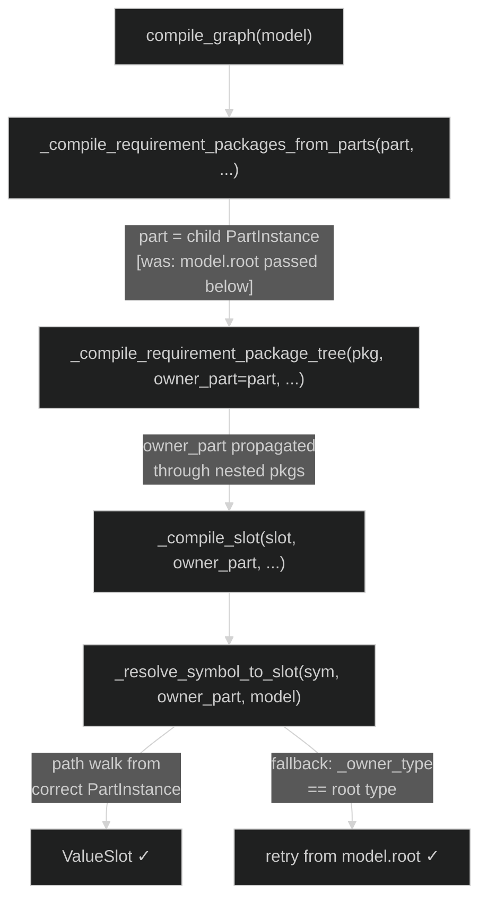
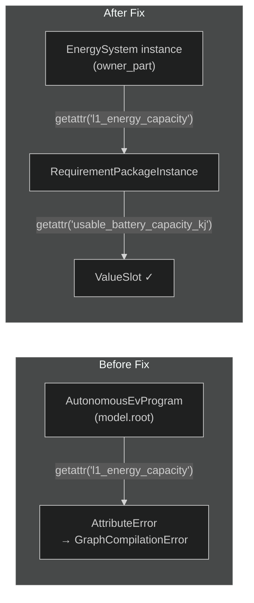

# Implementation Plan — Graph Compiler: Fix Requirement Package Owner Resolution in System-in-System Models

**Status:** Draft for review  
**Audience:** Implementers and reviewers  
**Related design context:** [`execution_methodology.md`](execution_methodology.md) (Phase 4 — Dependency Graph Compilation), [`logical_architecture.md`](logical_architecture.md) (Execution Subsystem)

---

## Table of Contents

1. [Purpose and scope](#1-purpose-and-scope)
2. [Design philosophy](#2-design-philosophy)
3. [Methodology](#3-methodology)
4. [Root cause](#4-root-cause)
5. [Technical approach](#5-technical-approach)
6. [Architecture](#6-architecture)
7. [File tree](#7-file-tree)
8. [Phased delivery and GO / NO-GO gates](#8-phased-delivery-and-go--no-go-gates)
9. [Test plan](#9-test-plan)
10. [Risks and mitigations](#10-risks-and-mitigations)

---

## 1. Purpose and scope

**Bug:** When a `Requirement` is composed inside a child `System` (System-in-System), any `attribute()` slot on that requirement with an `expr=` that references another slot within the same child System causes a `GraphCompilationError` at evaluation time.

**Example error:**
```
GraphCompilationError: Symbol 'l1_energy_capacity.usable_battery_capacity_kj'
has registered path ('l1_energy_capacity', 'usable_battery_capacity_kj')
but could not be resolved under 'AutonomousEvProgram'
```

**In scope:**

- Fix `_compile_requirement_package_tree` in `tg_model/execution/graph_compiler.py` to use the correct owning `PartInstance` when compiling requirement package slots.
- Fix the call site in `_compile_requirement_packages_from_parts` to pass the current `part` rather than delegating owner resolution down.
- Verify the existing `_resolve_symbol_to_slot` fallback (for cross-boundary root references) still works correctly after the fix.
- Add targeted unit and integration tests.

**Out of scope:**

- Any change to the `_resolve_symbol_to_slot` fallback logic (it is correct and unaffected).
- Any change to symbol registration or `_symbol_id_to_path`.
- Any change to the public DSL API.

---

## 2. Design philosophy

| Principle | How it applies here |
|-----------|---------------------|
| **Simpler is better** | The fix is a single new parameter — `owner_part` — threaded through two functions. No new abstractions, no new types. |
| **SOLID — Single Responsibility** | Each function already has one job. The fix keeps that clean: the caller knows which part owns the package; the callee uses the owner it is given. |
| **Small, single-purpose functions** | No function grows. The change is additive (a parameter + propagation). |
| **Fail loudly** | The error already fails loudly. The fix makes it not fail in the first place on valid models. |

---

## 3. Methodology

**Understand before touching:** The root cause is a single hardcoded `model.root` at one call site. The fix is local and surgical. No architectural changes needed.

**Inside-out delivery:** Fix the compiler first, gate on tests passing, then document.

**No regression tolerance:** The existing test suite must pass unchanged. This fix expands what is supported, not what was previously working.

---

## 4. Root cause

### Symbol path registration

When `EnergySystem.define()` calls `model.composed_of("l1_energy_capacity", EnergyCapacityRequirement)`, the DSL records each symbol created inside `EnergyCapacityRequirement.define()` with a `symbol_path_prefix` of `('l1_energy_capacity',)`. A parameter declared as `"usable_battery_capacity_kj"` inside the requirement therefore registers in `_symbol_id_to_path` as:

```
_owner_type  = EnergySystem
tg_path      = ('l1_energy_capacity', 'usable_battery_capacity_kj')
```

That path is relative to **`EnergySystem`**, not to the root system.

### The broken call site

In `_compile_requirement_package_tree`, every non-overridden `parameter` and `attribute` slot is compiled via:

```python
_compile_slot(slot, model.root, graph, handlers, model)
```

`model.root` is always the top-level root `System` instance. For a directly nested requirement (at depth 1 under root) this works: the path walk finds the requirement package as a direct child of root. For a requirement nested inside a child `System`, the path walk cannot find `l1_energy_capacity` as a direct attribute of `AutonomousEvProgram`, so it fails.

### Why the fallback in `_resolve_symbol_to_slot` does not help

The fallback exists for the opposite case — where a symbol's registered owner type is the **root** but the caller passes a **child part** as owner. Here, the caller always passes `model.root`, so the fallback condition (`_owner_type is not owner.definition_type`) is never true.

### How the fix restores correctness

If the owning `PartInstance` is `EnergySystem`'s instance, the symbol walk becomes:

1. `getattr(energy_system_instance, 'l1_energy_capacity')` → `RequirementPackageInstance`  
2. `getattr(req_pkg_instance, 'usable_battery_capacity_kj')` → `ValueSlot` ✓

The existing fallback in `_resolve_symbol_to_slot` still handles cross-boundary root references correctly because:
- After the fix, `owner` is the child System instance.  
- If a symbol has `_owner_type == root System type` (e.g. via `parameter_ref`), the first walk fails, the fallback condition becomes `True`, and resolution retries from `model.root`.

---

## 5. Technical approach

### Change 1: Add `owner_part` parameter to `_compile_requirement_package_tree`

The function gains one required parameter: `owner_part: PartInstance`. This is the `PartInstance` that owns the requirement package in the runtime instance tree.

Inside the function, the line:
```python
_compile_slot(slot, model.root, graph, handlers, model)
```
becomes:
```python
_compile_slot(slot, owner_part, graph, handlers, model)
```

When the function recurses into nested `RequirementPackageInstance` children, `owner_part` is propagated unchanged — the owning `PartInstance` does not change as you descend into nested requirement packages.

### Change 2: Update `_compile_requirement_packages_from_parts` to pass `part`

The call site that invokes `_compile_requirement_package_tree` gains the `owner_part=part` argument. The `part` local variable is already the correct `PartInstance` at every recursive depth because `_compile_requirement_packages_from_parts` recurses into children via `part.children`.

No other call sites for `_compile_requirement_package_tree` exist.

### Non-change: `_resolve_symbol_to_slot`

This function requires no modification. Its fallback branch remains correct and continues to serve the cross-boundary root reference case.

---

## 6. Architecture

### Where the fix lives in the compilation pipeline



### Owner resolution: before vs. after



---

## 7. File tree

Only one source file changes. One new test file is added.

```text
thundergraph-model/
└── tg_model/
│   └── execution/
│       └── graph_compiler.py          ← MODIFIED: _compile_requirement_packages_from_parts,
│                                                    _compile_requirement_package_tree
└── tests/
    ├── unit/
    │   └── execution/
    │       └── test_graph_compiler.py ← MODIFIED: new test cases for nested system owner resolution
    └── integration/
        └── evaluation/
            └── test_allocate_parameter_wiring.py  ← MODIFIED: new System-in-System scenario
```

---

## 8. Phased delivery and GO / NO-GO gates

### Phase 1 — Source fix

**Deliverable:** Two targeted changes to `graph_compiler.py`:
1. `owner_part: PartInstance` parameter added to `_compile_requirement_package_tree`.
2. `_compile_requirement_packages_from_parts` passes `part` as `owner_part` at the call site.

**GO criteria:**
- `ruff` and `pyright` pass with no new errors on `graph_compiler.py`.
- Full existing test suite (`pytest thundergraph-model/tests/`) passes without any regressions.

**NO-GO triggers:**
- Any existing test that previously passed now fails.
- Type checker reports an error on the new parameter or its propagation.

---

### Phase 2 — Tests

**Deliverable:** New unit tests and an integration test that would have caught this bug.

**Unit tests** in `tests/unit/execution/test_graph_compiler.py`:
- A System-in-System model where a child System composes a `Requirement` with an `attribute(expr=...)`. Assert that `compile_graph` succeeds and the graph contains the expected nodes.
- A System-in-System model where the requirement also references a root-level parameter via `parameter_ref` (the cross-boundary fallback path). Assert that `compile_graph` succeeds.
- Negative case: an expression symbol that is genuinely unregistered still raises `GraphCompilationError`.

**Integration test** in `tests/integration/evaluation/test_allocate_parameter_wiring.py`:
- A `System` → child `System` → `Part` + `Requirement` topology.
- The `Requirement` has a derived `attribute(expr=param_a - param_b)`.
- `allocate(inputs=...)` wires the requirement parameters from the child Part's slots.
- `evaluate()` produces the correct derived attribute value and passes the constraint.

**GO criteria:**
- All new tests pass.
- No new ruff or pyright errors in test files.

**NO-GO triggers:**
- A new test cannot reproduce the original bug before the fix is applied (the test is not meaningful).
- Any pre-existing test now fails.

---

### Phase 3 — Documentation update

**Deliverable:** A brief note appended to [`execution_methodology.md`](execution_methodology.md) under Phase 4 (Dependency Graph Compilation) clarifying that requirement package slots are compiled relative to the `PartInstance` that owns the package, not relative to the global root.

**GO criteria:**
- Documentation sentence is accurate and references the correct function names.

---

## 9. Test plan

### Unit tests

**Location:** `tests/unit/execution/test_graph_compiler.py`

| Test | What it verifies |
|------|-----------------|
| `test_compile_graph_system_in_system_requirement_attribute_expr` | `compile_graph` succeeds and produces a `LOCAL_EXPRESSION` node for a derived `attribute` on a requirement nested inside a child System. |
| `test_compile_graph_system_in_system_requirement_constraint_edges` | The constraint check node for the same requirement has correct dependency edges to the derived attribute's value node. |
| `test_compile_graph_cross_boundary_root_ref_still_resolves` | A requirement inside a child System whose expression references a root-level parameter (via `parameter_ref`) still compiles without error — the fallback path in `_resolve_symbol_to_slot` is not broken by the fix. |
| `test_compile_graph_unregistered_symbol_still_raises` | An expression containing a symbol that was never registered through the DSL still raises `GraphCompilationError` with the expected message. |

### Integration tests

**Location:** `tests/integration/evaluation/test_allocate_parameter_wiring.py`

| Test | What it verifies |
|------|-----------------|
| `test_system_in_system_requirement_attribute_evaluates_correctly` | End-to-end evaluation of a System-in-System model: the derived `attribute` on the nested requirement receives the correct value after `evaluate()`. |
| `test_system_in_system_requirement_constraint_passes_when_satisfied` | The requirement constraint evaluates to satisfied when the input values meet the condition. |
| `test_system_in_system_requirement_constraint_fails_when_violated` | The requirement constraint evaluates to violated when the input values do not meet the condition. |

### Regression

The full existing test suite (`pytest thundergraph-model/tests/`) must continue to pass unchanged after each phase.

---

## 10. Risks and mitigations

| Risk | Likelihood | Mitigation |
|------|-----------|------------|
| Nested `RequirementPackageInstance` within a `RequirementPackageInstance` is not tested and gets the wrong `owner_part` | Low — propagation is straightforward; `owner_part` does not change for nested requirement packages | Unit test covering two-level requirement nesting confirms propagation |
| Cross-boundary root reference fallback in `_resolve_symbol_to_slot` stops working after the owner changes | Low — the fallback condition checks `_owner_type is model.root.definition_type`, which is unaffected by what `owner` we pass | Dedicated unit test `test_compile_graph_cross_boundary_root_ref_still_resolves` guards this path |
| Fix changes behaviour for existing models that already work | Very low — we only change what `owner` is passed when a requirement package lives under a non-root part; existing tests cover the root case | Full regression run in Phase 1 gate |
