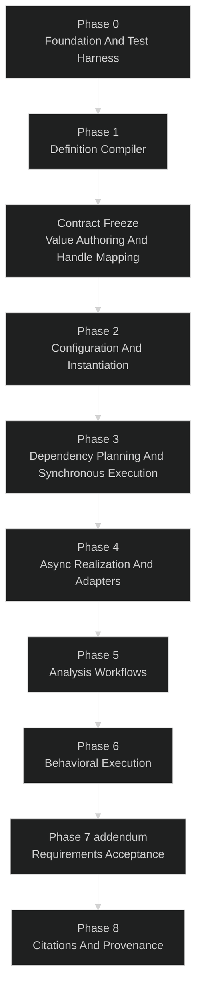

# tg-model Implementation Plan

## Purpose

This document defines the phased implementation plan for `tg-model`.

It translates the current design set into an execution plan that is:

- detailed enough to guide engineering work
- aggressively gated to reduce architectural thrash
- biased toward simple, readable, testable implementation
- explicit about what must be proven before the next phase begins

This plan is intentionally shaped by:

- `docs/logical_architecture.md`
- `docs/execution_methodology.md`
- `docs/behavior_methodology.md`
- `docs/v0_api.md`
- `docs/conceptual_requirements.md`

This is a plan for building the **library**, not ThunderGraph product features.

## Table of Contents

- [Planning Intent](#planning-intent)
- [Design Philosophy](#design-philosophy)
- [Scope And Non-Goals](#scope-and-non-goals)
- [Implementation Methodology](#implementation-methodology)
- [Target Package Direction](#target-package-direction)
- [Phase Overview](#phase-overview)
- [Phase 0: Foundation And Test Harness](#phase-0-foundation-and-test-harness)
- [Phase 1: Definition Compiler And Structural Semantics](#phase-1-definition-compiler-and-structural-semantics)
- [Contract Freeze: Value Authoring And Handle Mapping](#contract-freeze-gate)
- [Phase 2: Configuration And Instance Realization](#phase-2-configuration-and-instance-realization)
- [Phase 3: Dependency Planning And Synchronous Execution](#phase-3-dependency-planning-and-synchronous-execution)
- [Phase 4: Async Realization And Integration Adapters](#phase-4-async-realization-and-integration-adapters)
- [Phase 5: Analysis Workflows And Reuse Boundaries](#phase-5-analysis-workflows-and-reuse-boundaries)
- [Phase 6: Behavioral Execution](#phase-6-behavioral-execution)
- [Phase 7 (addendum): Requirements And Acceptance Semantics](#phase-7-addendum-requirements-and-acceptance-semantics)
- [Phase 8: Citations And Provenance Links](#phase-8-citations-and-provenance-links)
- [Cross-Cutting Testing Strategy](#cross-cutting-testing-strategy)
- [Requirement Coverage Direction](#requirement-coverage-direction)
- [Go/No-Go Review Checklist](#gono-go-review-checklist)
- [References](#references)

## Planning Intent

The plan is built around one core principle:

- **Do not build the full library at once.**

`tg-model` has several different concerns that are easy to tangle together:

- authoring-time declaration capture
- configuration and topology realization
- dependency planning
- single-run value execution
- async orchestration
- analysis workflows
- behavioral execution

If these are developed in parallel too early, the result will be a blurry system that is difficult to validate and difficult to refactor. The phases below force the team to prove one layer at a time.

## Design Philosophy

The implementation shall follow the ThunderGraph design philosophy:

- simpler and more elegant architectures are preferred as long as they satisfy requirements
- functions should be small and focused on one job
- responsibilities should be separated clearly
- internal abstractions should be introduced only when they remove real duplication or ambiguity

Additional implementation posture for this plan:

- prefer straightforward Python over clever metaprogramming
- keep public authoring semantics readable for power users and reliable for LLM generation
- prove each phase primarily through unit and integration tests, not through sprawling prototype code hidden in docs
- preserve the library boundary: no product-specific persistence or frontend concerns

## Scope And Non-Goals

### In scope

- the `tg-model` Python library
- package structure and module boundaries
- phased implementation of model, execution, analysis, integration, and export surfaces
- test strategy and go/no-go gates

### Out of scope

- ThunderGraph application integration
- Neo4j or proprietary persistence
- frontend rendering workflows
- deployment, sandboxing, or networking strategy
- heavy physics solvers beyond adapter boundaries

## Implementation Methodology

The implementation shall follow the execution lifecycle already established in `execution_methodology.md`:

1. compile type definitions
2. resolve configuration
3. instantiate configured topology
4. compile the configuration-scoped dependency graph
5. statically validate evaluability
6. execute a single run
7. layer multi-run workflows on top
8. add behavioral execution only after the structural/value spine is proven

The codebase should mirror this lifecycle rather than hiding it behind one giant runtime object.

### Guiding engineering rules

- every phase must produce a stable artifact that later phases consume
- each phase must have both unit and integration test proof
- any unresolved contradiction between docs and code is a stop signal at the gate
- behavior is explicitly the final major phase, not an early parallel track

## Target Package Direction

The package tree below is a **target direction**, not a requirement to create every file immediately. It is intentionally simple and aligned with the logical architecture.

```text
thundergraph-model/
├── docs/
│   ├── implementation_plan.md
│   ├── logical_architecture.md
│   ├── execution_methodology.md
│   ├── behavior_methodology.md
│   ├── v0_api.md
│   ├── conceptual_requirements.md
│   ├── use_cases.md
│   └── brainstorm.md
└── tg_model/
    ├── model/
    │   ├── __init__.py
    │   ├── elements.py
    │   ├── definition_context.py
    │   ├── refs.py
    │   ├── identity.py
    │   ├── compile_types.py
    │   ├── configuration.py
    │   └── declarations/
    │       ├── __init__.py
    │       ├── structure.py
    │       ├── requirements.py
    │       ├── values.py
    │       └── behavior.py
    ├── execution/
    │   ├── __init__.py
    │   ├── configured_model.py
    │   ├── instances.py
    │   ├── value_slots.py
    │   ├── connection_bindings.py
    │   ├── constraint_bindings.py
    │   ├── solve_groups.py
    │   ├── solvers.py
    │   ├── run_context.py
    │   ├── dependency_graph.py
    │   ├── validation.py
    │   ├── evaluator.py
    │   └── behavior.py
    ├── analysis/
    │   ├── __init__.py
    │   ├── sweep.py
    │   ├── compare_variants.py
    │   └── impact.py
    ├── integrations/
    │   ├── __init__.py
    │   ├── adapters.py
    │   ├── async_runtime.py
    │   └── results.py
    └── export/
        ├── __init__.py
        └── graph_export.py
tests/
    ├── unit/
    │   ├── model/
    │   ├── execution/
    │   ├── analysis/
    │   ├── integrations/
    │   └── export/
    └── integration/
        ├── structural_models/
        ├── evaluation/
        ├── variants/
        ├── async_integrations/
        ├── studies/
        └── behavior/
```

### Package rationale

- `model/` owns authoring-time concepts, semantic identity, and type compilation
- `execution/` owns configured topology, validation, dependency planning, and run execution
- `analysis/` owns orchestration of many runs, not value resolution itself
- `integrations/` owns backend boundaries and async realization mechanics
- `export/` stays small until core semantics stabilize

## Phase Overview



### Phase dependency rule

No phase may begin as full implementation work until the previous phase passes its go/no-go gate. Limited exploratory spikes are acceptable only if they do not become hidden production commitments.

### Contract freeze gate

Between Phase 1 and Phase 2, the plan requires a **contract freeze** that resolves the public authoring and handle semantics that downstream phases depend on. This is not a new methodology document. It is a focused addendum to `v0_api.md` that replaces illustrative class-body patterns with locked authoring decisions.

The contract freeze must settle exactly these items:

1. **Value construct taxonomy** — the public distinction between `parameter`, `attribute`, derived attribute, `constraint`, roll-up, `solve_group`, and `computed_by` as authoring-time declarations
2. **Authoring surface** — how each of those constructs registers through `define(cls, model)` or a companion hook, replacing the current mix of illustrative class-body examples and TBD notes
3. **Ref-to-handle mapping** — the public rule for converting definition-time `Ref` paths into instance-time handles used by `evaluate`, `sweep`, and export
4. **Minimum execution API** — the locked shapes of `evaluate(...)`, `validate(...)`, and `configure(...)` at enough detail to implement Phase 2 handle registries and Phase 3 execution
5. **Minimum external-computation interface** — the locked contract for `ExternalCompute` / `ExternalComputeBinding` / `ExternalComputeResult` (see `v0_api.md`, **Frozen decision 5**), sufficient for Phase 4 but defined early enough to avoid churn in `computed_by` declarations

Items 1-3 must be frozen before Phase 2 completes. Item 4 must be frozen before Phase 3 begins. Item 5 must be frozen before Phase 4 begins.

The contract freeze is a **go/no-go gate** with the same rigor as a phase gate. If the authoring surface is still ambiguous after the freeze attempt, that is a no-go for Phase 2 and Phase 3.

## Phase 0: Foundation And Test Harness

### Objective

Establish a clean project foundation so later phases can be validated quickly and repeatedly.

### In scope

- package scaffolding for `model`, `execution`, `analysis`, `integrations`, and `export`
- test directory scaffolding
- pytest configuration and shared fixtures
- minimal example model fixtures used repeatedly across later phases
- baseline coding patterns for small cohesive modules

### Out of scope

- real execution logic
- variant realization
- async backends
- behavior

### Deliverables

- stable test harness and fixture strategy
- repository structure aligned with the target package direction
- a small set of canonical example model definitions for repeated tests

### Unit testing focus

- package imports are stable
- core modules can be imported independently without circular imports
- shared fixtures load and isolate cleanly

### Integration testing focus

- the package can be installed and imported as a library
- example models can be discovered and used by tests without test-order coupling

### Go/No-Go gate

Go only if:

- the package layout is coherent
- tests are runnable in a stable repeatable way
- no circular-import mess has appeared in the foundation modules

No-go if:

- the initial package structure already feels tangled
- fixtures are overly magical or too coupled to internal implementation

## Phase 1: Definition Compiler And Structural Semantics

### Objective

Implement the authoring-time semantic core and prove that `define(cls, model)` can compile reliable canonical type artifacts.

### In scope

- `Element`, `System`, `Part`, and initial structural element types
- `ModelDefinitionContext`
- `Ref` types (`PartRef`, `PortRef`, `AttributeRef`, and immediate extensions needed for requirements/parameters if included in this phase)
- duplicate declaration validation
- broken reference validation at type-compile time
- deterministic declaration-path capture
- stable identity policy at the declaration/type level

### Recommended module focus

- `tg_model/model/elements.py`
- `tg_model/model/definition_context.py`
- `tg_model/model/refs.py`
- `tg_model/model/identity.py`
- `tg_model/model/compile_types.py`

### Deliverables

- canonical compiled type artifacts for structural models
- typed nested `Ref` resolution against child type definitions
- structural declarations for parts, ports, attributes, parameters, requirements, allocations, and connections at the model level if ready

### Unit testing focus

- `define(cls, model)` records declarations deterministically
- `PartRef.__getattr__`-style lookup resolves only valid declared members
- duplicate declarations are rejected
- invalid cross-type references are rejected
- stable type-level identities and declaration paths are deterministic

### Integration testing focus

- a small `DriveSystem`-style model compiles into the expected canonical artifact
- nested structural models compile recursively
- requirements and allocations, if included, survive compilation and export-ready structure

### Go/No-Go gate

Go only if:

- compiled type artifacts are stable and inspectable
- structural reference validation is reliable
- there is one obvious authoring path for structure

No-go if:

- the compiler depends on runtime instance semantics
- declarations are leaking into ad hoc mutable global state
- the team is compensating for unclear type artifacts with test-only hacks

## Phase 2: Configuration And Instance Realization

### Objective

Turn compiled type artifacts into a real configured topology without yet solving full value execution.

### In scope

- configuration descriptors
- top-down variant resolution for v0
- `ConfiguredModel`
- `PartInstance`, `PortInstance`, `ValueSlot`, `ConnectionBinding`, and initial `ConstraintBinding` shells
- deterministic instance paths and stable runtime IDs
- instance-handle registries by path and ID

### Out of scope

- dependency scheduling
- async orchestration
- full behavior

### Recommended module focus

- `tg_model/model/configuration.py`
- `tg_model/execution/configured_model.py`
- `tg_model/execution/instances.py`
- `tg_model/execution/value_slots.py`
- `tg_model/execution/connection_bindings.py`

### Deliverables

- a mechanical instantiator that walks the active type artifact and creates configured topology
- v0 configuration resolution that is explicitly top-down, not a solver
- immutable configured topology suitable for repeated runs

### Unit testing focus

- variant selection activates the correct structural branches
- instance paths are deterministic
- stable IDs are deterministic under identical structure/configuration
- structural equality implies identity equality when explicit IDs are absent
- configured topology rejects missing required children or unresolved selections

### Integration testing focus

- a compiled root model instantiates into a navigable configured graph
- repeated instantiation of the same configuration yields equivalent topology and IDs
- different structural variant selections yield different configured topologies and graphs

### Go/No-Go gate

Go only if:

- configured topology is immutable with respect to structure
- path and identity mapping are deterministic
- the configured model can be navigated without special-case hacks

No-go if:

- runtime values are already being stuffed directly onto topology objects in a way that blocks run isolation
- variant resolution is turning into implicit global constraint solving
- contract freeze items 1-3 (value construct taxonomy, authoring surface, Ref-to-handle mapping) are not yet frozen

## Phase 3: Dependency Planning And Synchronous Execution

### Objective

Implement the bipartite dependency graph, static validation, `RunContext`, and the synchronous execution path for directed expressions, roll-ups, explicit solve groups, constraints, and deterministic evaluation.

### In scope

- `RunContext`
- value-side and compute-side dependency nodes
- configuration-scoped dependency graph compilation
- graph pruning for requested outputs
- pre-execution static validation
- synchronous evaluation loop
- explicit solve-group declarations and local solver boundary
- constraint evaluation over realized values
- run result object

### Out of scope

- async backends
- real job polling
- full behavioral execution

### Recommended module focus

- `tg_model/execution/run_context.py`
- `tg_model/execution/dependency_graph.py`
- `tg_model/execution/solve_groups.py`
- `tg_model/execution/solvers.py`
- `tg_model/execution/validation.py`
- `tg_model/execution/evaluator.py`

### Deliverables

- deterministic dependency planning from configured topology
- explicit distinction between value nodes and compute nodes
- explicit distinction between directed evaluation, roll-ups, solve groups, and constraints
- run-scoped state isolated from configured topology
- a first local solve-group backend suitable for small engineering equation systems
- `evaluate()` and `validate()` for synchronous models

### Unit testing focus

- dependency graph node and edge creation for parameters, derived attributes, roll-ups, solve groups, and constraints
- cycle detection
- dimensional validation failures
- `RunContext` isolation from `ConfiguredModel`
- solve-group convergence, underdetermined-system, and inconsistent-system handling
- failure propagation and blocked-node semantics

### Integration testing focus

- a model with parameters, derived attributes, roll-ups, solve groups, and constraints can evaluate end to end
- roll-up values compute correctly across hierarchy
- explicit solve-group models solve for declared unknowns and fail clearly when ill-posed
- repeated runs over the same configured topology produce isolated results
- deterministic results are observed for identical model state and inputs

### Go/No-Go gate

Go only if:

- contract freeze item 4 (minimum execution API) is frozen
- synchronous evaluation works on realistic test models
- `RunContext` isolation is proven by integration tests
- pre-execution validation catches invalid models before execution starts
- explicit solve-group support is proven on small but real engineering relationships

No-go if:

- the dependency graph is still ambiguous about value nodes vs compute nodes
- run state leaks across repeated evaluations
- solve behavior is being smuggled into generic constraints instead of explicit solve groups
- constraints are mixed with async orchestration
- the authoring surface for value constructs is still ambiguous or inconsistent with the frozen contract

## Phase 4: Async Realization And Integration Adapters

### Objective

Add async realization for `computed_by`-style work without contaminating the authoring model or breaking deterministic execution semantics.

### In scope

- adapter interfaces
- async job submission and polling boundaries
- pending/failure state transitions in `RunContext`
- provenance capture for external results
- required-backend validation

### Out of scope

- large-scale physics implementation
- product networking concerns

### Recommended module focus

- `tg_model/integrations/adapters.py`
- `tg_model/integrations/async_runtime.py`
- `tg_model/integrations/results.py`
- execution-layer integration points in `evaluator.py`

### Deliverables

- clean adapter boundary for external computations
- async value realization that fits the existing dependency graph and run model
- fail-fast validation for missing backend bindings

### Unit testing focus

- adapter contract validation
- pending to realized transitions
- async failure propagation
- timeout/cancellation semantics
- provenance recording

### Integration testing focus

- a model with an externally realized attribute evaluates end to end through a fake adapter
- dependent nodes wait correctly for required async results
- repeated async runs remain isolated through separate `RunContext`s

### Go/No-Go gate

Go only if:

- contract freeze item 5 (minimum external-computation interface; `v0_api.md` Frozen decision 5) is frozen
- async realization is contained inside the execution/integration boundary
- authoring-time DSL remains synchronous and declarative
- fake backend integration tests are reliable and deterministic

No-go if:

- async leaks into model authoring semantics
- adapters force product-specific infrastructure assumptions

## Phase 5: Analysis Workflows And Reuse Boundaries

### Objective

Implement multi-run workflows that reuse the single-run engine correctly without creating a second execution path.

### In scope

- `sweep(...)`
- variant comparison orchestration
- impact analysis queries if they can be backed by the dependency and traceability structures already built
- result streaming to sinks/collectors
- structure reuse vs run-state isolation

### Recommended module focus

- `tg_model/analysis/sweep.py`
- `tg_model/analysis/compare_variants.py`
- `tg_model/analysis/impact.py`

### Deliverables

- parameter sweeps over one configured topology
- variant comparisons across isolated configured models
- result streaming support

### Unit testing focus

- sweep planning
- sink invocation semantics
- correct reuse of configured topology and dependency graph
- no reuse of `RunContext` state between runs

### Integration testing focus

- a parametric study runs over many inputs with stable isolated results
- structurally distinct variants compile to independent configured models and graphs
- study results stream incrementally to a fake sink

### Go/No-Go gate

Go only if:

- analysis is clearly orchestrating execution rather than duplicating it
- sweeps prove reuse boundaries cleanly
- variant comparison remains understandable and deterministic

No-go if:

- study code forks a parallel evaluator
- performance shortcuts break run isolation

## Phase 6: Behavioral Execution

### Scope governance (non-negotiable)

**`behavior_methodology.md` is the contract for Phase 6.** Reducing Phase 6 relative to that document is a **scope change**, not a silent edit to this plan.

- Any **cut or deferral** of methodology obligations requires **explicit approval** from the plan owner (you) and a **short written rationale** (ADR or a subsection here: what is deferred, why, and what gate replaces it).
- **Do not** narrow Phase 6 in prose to match partial code without that approval. Partial implementation is tracked as **work remaining**, not as a redefinition of “done.”

### Objective

Deliver **full behavioral model execution** as specified in **`docs/behavior_methodology.md`**: the complete core ontology, the **execution hierarchy** (event → transition/guard → state → action → item propagation → derived events), **structural boundaries** (inter-part behavior only via ports/flows and item arrival), **discrete logical time** (including constrained `Fork`/`Join` semantics per the methodology), and the **authored scenario vs runtime trace** split.

Phase 6 is **not** optional philosophy. It is the engineering phase that makes the methodology **executable** on the existing structural/value spine (`RunContext`, `ConfiguredModel`, `Evaluator`, ports, connections).

### Core ontology (all in scope — must be authorable and executable)

Per **Methodology Summary** and **Core Behavioral Ontology** in `behavior_methodology.md`, the library shall support:

| Concept | Execution obligation |
|--------|----------------------|
| **Action** | Discrete work; reads/writes attributes and/or **emits Items to ports** per methodology |
| **Decision** | Branching control flow; evaluates **Guard** conditions to choose the next branch |
| **Merge** | Reunites exclusive branches |
| **Fork** | Splits into parallel logical branches (methodology’s v0 deterministic concurrency rules) |
| **Join** | Synchronizes required branches before continuation |
| **State** | Discrete mode per part; constrains valid transitions |
| **Transition** | Event + optional **Guard** + state change + optional effect **Action** |
| **Guard** | **First-class** behavioral routing primitive (shared semantic for transitions and decisions); **not** a substitute for **Constraint** |
| **Event** | Discrete triggers including **item arrival at a port** and internal signals |
| **Item** | Typed thing that **moves along flows**; sequence/trace semantics require **what** moved **between whom** in order |
| **Scenario** | Authored contract: ordering, **initial conditions**, **expected outcomes** where the methodology calls for them |

### Execution hierarchy (must match methodology)

Implement the **default runtime order** in `behavior_methodology.md` (**Execution Hierarchy**), including:

1. Event arrival at a part (including events generated by item arrival).
2. State machine: transition candidates, **guard** resolution, **state** update, then transition effect **action** (ordering locked to the methodology and documented in API).
3. Direct **action** dispatch where the methodology allows when no state machine applies.
4. **Item** propagation along **structural** connections; arrival at a target port generates a **new event** for the receiving part.
5. Deterministic **Fork**/**Join** behavior: same methodology constraints (logical concurrency, no wall-clock pretense, join blocks until required branches complete).

### Structural boundaries (must enforce)

- No cross-part **action** calls: **Part A** does not invoke **Part B**’s actions directly.
- Inter-part behavior only through **ports**, **flows**, and **items** as in **Structural Boundaries** / **Intra-Part vs Inter-Part Behavior**.

### Explicit out of scope (methodology already defers these)

- **Continuous physical time** and hard real-time scheduling (methodology: discrete logical time for v0; future timing extensions are separate).
- **SysML v2-style academic sprawl** as a goal (methodology already says avoid that).
- Anything the methodology labels as **future extension** (explicit delays, logical clocks, etc.) unless pulled in by a separate approved change.

### Sequenced workstreams (implementation order — full scope, not optional drops)

Workstreams are **ordering aids**. Skipping a workstream requires the **scope governance** approval above.

1. **6.1 — Ontology authoring surface**  
   Extend `define(cls, model)` (and refs/compile) so every ontology element above is **declarable**, **validated at compile time**, and **serializable** in the type artifact where the methodology requires static reasoning.

2. **6.2 — Runtime state and dispatch spine**  
   Unify **behavioral state** (modes, activity tokens, fork/join counters, item queues per methodology) on the same **`RunContext`** / instance spine; **no** second parallel “behavior world.”

3. **6.3 — Guards and decisions**  
   **First-class `Guard`** (or equivalent compiled representation); **Decision**/**Merge** execution wired to the same guard semantics as transitions.

4. **6.4 — Activity graph: Fork / Join**  
   Executable activity regions with methodology-compliant deterministic completion and join rules.

5. **6.5 — Items and inter-part propagation**  
   Item types (or references), port emission/consumption, flow propagation, **event generation** at receivers, multi-part traces.

6. **6.6 — Scenarios and trace validation**  
   **Authored scenario** vs **runtime trace** per **Static Contract vs Runtime Trace**: match methodology expectations (ordering, participants, items, states/outcomes — not only a single-part event-name equality).

7. **6.7 — Integration with value execution**  
   Documented **orchestration** with `Evaluator` (when guards/actions read realized values; when items depend on computed attributes) so behavior and compliance stay distinct but composable.

8. **6.8 — Diagram / export hooks**  
   Ensure traces and authored behavior are sufficient for **activity / state / sequence** projections (actual renderers may live in `export/` or later; the **semantic record** is a Phase 6 deliverable).

### Current code baseline (honest status)

**Implemented in code:** intra-part state machine; inline `when=` or first-class `guard=` on transitions; **`sequence`** / **`dispatch_sequence`**; **`decision`** / **`DecisionDispatchResult`** with optional **`merge_point=`**; **`fork_join`** / **`dispatch_fork_join`** (serial v0 semantics — see deferrals below); **`merge`** / **`dispatch_merge`**; **`item_kind`** / **`emit_item`**; extended **`BehaviorTrace`**; **`validate_scenario_trace`** (independent partial checks — see API docstring); **`behavior_authoring_projection`** / **`behavior_trace_to_records`**; **RunContext API discipline** for **guards, decision predicates, and effects** (same subtree rules via **`get_or_create_record`** and related accessors — not a language sandbox).

**Optional / product-side (not library-blocking for Phase 6 go/no-go):** dedicated looping activity constructs beyond repeated runtime dispatch; pixel/HTML diagram renderers (library supplies semantic projection + trace records). Treat optional items as deferrals only if the advisor or plan owner requests them explicitly.

### Phase 6 library v0 — recorded deferrals (gate must match code)

These are **explicit** differences from a maximal reading of `behavior_methodology.md`. They are **approved for v0** so the go/no-go checklist does not contradict the honest baseline. Any **additional** cut requires **Scope governance** (approval + rationale).

| Topic | v0 in code | Rationale |
|--------|----------------|-----------|
| **Fork/join** | **`dispatch_fork_join`** runs branch actions **serially** in list order (deterministic); no thread interleaving | Discrete logical time without a parallel runtime; naming preserves methodology **structure** for traces and diagrams |
| **Scenario vs trace** | **`validate_scenario_trace`** applies **several independent checks** (not one unified causal proof) | Incremental validation hooks; a single end-to-end contract can be a later phase if needed |
| **Structural boundaries** | **Subtree rules** on **`RunContext`** for guards, predicates, and effects | **API discipline** for well-behaved Python callables — not a sandbox (callables can still misuse **`ConfiguredModel`**) |

### Recommended module focus

- `model/definition_context.py`, `model/compile_types.py`, `model/refs.py`, `model/declarations/behavior.py` — authoring and compile rules for the **full** ontology
- `execution/behavior.py` (and related modules as complexity warrants) — **single** behavioral execution engine on `RunContext`
- `execution_methodology.md` alignment — behavioral steps in the **pipeline** after structural/value proof, without redefining identity or dependency compilation
- `analysis/` — only if multi-run **scenario studies** need orchestration; core scenario/trace semantics remain library behavior

### Unit testing focus

- declaration capture for **every** ontology element and illegal combinations
- guard semantics (transition vs decision); determinism; fork/join completion rules
- item creation, propagation, ordering, and **event** generation at boundaries
- scenario vs trace validation per methodology (including multi-part threads)
- failure modes: blocked joins, illegal direct cross-part invocation attempts (must be rejected)

### Integration testing focus

- end-to-end models: intra-part state + activity + inter-part item flow
- same `RunContext` for value realization and behavioral steps; **evaluate ↔ behavior** ordering cases required by the methodology
- traces that record **items** and **participants**, not only local event names
- no second evaluator or hidden behavior engine

### Go/No-Go gate

Go only if:

- phases 1 through 5 are stable
- **Phase 6 library v0** implements the **Core ontology** rows as **executable** in code **or** the gap is listed under **Phase 6 library v0 — recorded deferrals** above **or** under **Scope governance** with approval + rationale
- **Structural boundary rules** for behavior are implemented as **`RunContext`** subtree **API discipline** for **guards, predicates, and effects** (slot + discrete-state paths), consistent with **`v0_api.md`** — understanding this is **not** a Python sandbox
- behavioral runtime remains on the **same** identity/topology/`RunContext` spine
- **`behavior_methodology.md`**, **`v0_api.md`**, and code **agree** on what is **in v0** vs **deferred** (no silent checklist theater)

**Advisor review:** appropriate once the above holds — to confirm methodology fit, test sufficiency, and that **recorded deferrals** are acceptable for the product (or must be promoted to Scope governance items).

No-go if:

- behavior forces an unapproved rewrite of the structural/value spine
- behavior is used to hide broken execution underneath
- Phase 6 is declared “done” while a **material** methodology obligation is missing **and** it is **not** covered by **recorded deferrals** or **Scope governance**

## Phase 7 (addendum): Requirements And Acceptance Semantics

This phase is an **addendum** to the original sequencing: it **remediates** a gap exposed after Phase 6 — **requirements** today are primarily **declarative labels plus `allocate` traceability**, while **constraints** are authored as **sibling nodes on a part/system type** without a first-class **requirement → acceptance criterion → verdict** spine. That is enough for **value validation**, but it is **not** enough to answer, in the library: *“did this allocated requirement pass?”* without ad-hoc convention.

### Problem statement (honest)

- **`requirement(name, text, **metadata)`** does not own **evaluatable acceptance** in the same way **`parameter` / `attribute` / `constraint`** own value semantics.
- **`allocate(requirement → target)`** asserts **traceability**, not **satisfaction**.
- **Compliance** is currently **where the `constraint` node lives** (owner type), not **where the requirement lives**, so “fulfillment” is not a stable library concept tied to the requirement artifact.

### Design intent (target semantics)

**Requirements are the locus of acceptance:** each requirement should carry (by reference or inline declaration) **acceptance criteria** — generally **`constraint` expressions** (and/or explicit test hooks later) — whose **evaluation is attributed to the requirement** when validating a configured model / run.

- **Parts (and systems)** remain where **mutable state and structure** live; **expressions** still close over **handles/symbols** for slots on those elements.
- **Requirements** are where we **name, group, and report** the criteria that decide **pass/fail for that requirement**, scoped by **`allocate`** (and possibly richer **scope** metadata: which subtree, which ports, which scenario).
- **Part-level constraints** may remain **allowed** for engineering assertions that are **not** tied to a formal requirement ID — but the **product-facing “requirement satisfied”** story should not depend on hunting arbitrary constraints on random owners.

This matches common MBSE practice: *acceptance criteria* belong to the **requirement**, while *evidence* is *values on the physical/logical model* reached through allocation and structure.

### Scope governance

Phase 7 is **in scope** for the library if and only as it **reuses** the existing **value / constraint / RunContext / validation** machinery — it mainly **re-homes authoring and reporting**, not a second evaluator.

Any cut that leaves “requirements” as non-executable forever requires **explicit Scope governance** approval + rationale (same rule as Phase 6).

### Workstreams (proposed)

1. **7.1 — Authoring model** *(v0 implemented)*  
   **`model.requirement(..., expr=...)`** stores **`_accept_expr`**. Optional **requirement-local parameters** (metadata-only vs real slots) remains a **follow-on** if needed.

2. **7.2 — Compilation and identity** *(v0 implemented)*  
   Compile-time check: requirement with **`expr`** must have **`allocate`** from it. **`compile_graph`** adds **`reqcheck:`** nodes; symbols resolve via **`allocate` target** (paths from system owner vs target part type — see **`v0_api.md`**).

3. **7.3 — Validation API** *(v0 implemented)*  
   **`summarize_requirement_satisfaction`** (**`RequirementSatisfactionSummary`**: **`check_count`**, **`all_passed`**) plus **`iter_requirement_satisfaction`** / **`all_requirements_satisfied`** over **`constraint_results`** (tagged **`requirement_path`**). **`all_passed` / `all_requirements_satisfied`** are **False** when **`check_count == 0`**. Name **`validate_requirements`** reserved if a fuller aggregate API is added later.

4. **7.4 — Documentation** *(v0 implemented for acceptance slice)*  
   **`v0_api.md`** distinguishes **traceability (`allocate`)** vs **satisfaction (`expr` on requirement)**.

### Go/No-Go gate (Phase 7)

Go only if:

- a **configured** model with **allocated requirements** can produce **deterministic requirement-level pass/fail** from **declared acceptance criteria** (**`expr=`** on **`requirement`**, evaluated via **`compile_graph` + `Evaluator`**, reported via **`summarize_requirement_satisfaction`** / **`iter_requirement_satisfaction`** / **`all_requirements_satisfied`**, with **non-vacuous** “all passed” semantics when there are zero checks)
- **no silent duplication** of constraint engines — one evaluation spine, two authoring/reporting lenses at most
- **`v0_api.md`** states clearly what **`allocate`** means vs **satisfaction**

No-go if:

- “Phase 7” becomes a **parallel compliance universe** that bypasses **`Evaluator` / `validate_graph`**
- requirements become **magic prose** again with **no executable criteria**

### Relation to Phase 6

Behavioral **scenarios** and **traces** may later **feed** requirement evidence (e.g. ordering, states), but Phase 7 **must not** redefine Phase 6 dispatch semantics. Cross-linking is a **follow-on**, not a prerequisite for minimal acceptance-on-values.

### Phase 7 library v0 — recorded limitations

- **Reporting:** requirement acceptance results are a **filtered view** of **`constraint_results`**, not a separate verdict stream with its own versioning yet.
- **Identity:** symbol / owner matching relies on **Python `type` object identity** (`is`) consistent with **`AttributeRef.owner_type`**; class reloads or duplicate type objects remain out-of-scope foot-guns for v0.

## Phase 8: Citations And Provenance Links

This phase is **implemented (library v0)**. It closes a structural gap: the library already supports rich **architecture, values, behavior, and requirement acceptance**; Phase 8 adds a **first-class, uniform way to attach external provenance** (standards, analysis reports, licensing inputs, safety basis paragraphs, journal or handbook references) to **authored elements** via **`citation`** nodes and **`references`** edges.

### Problem statement

- **Traceability** today is mostly **internal** (structure, allocation, constraints). **External** “why we believe this” or “where this came from” lives in **ad-hoc metadata dicts**, notebooks, or tools outside the model — if at all.
- Without a shared **citation** primitive and a single **relationship name**, exporters, reviewers, and LLM-assisted authoring cannot rely on a **stable graph pattern** for references.
- **Requirements** (Phase 7) especially benefit from explicit **normative / informative** references; the same mechanism should apply to **parts, parameters, constraints, ports, behavior**, and other declaration kinds without one-off APIs per type.

### Design intent

1. **Citation node type** — Introduce a **`citation`** declaration kind under `tg_model/model` (authoring surface + compiled node metadata), analogous in spirit to **`requirement`**: a named node carrying **structured + open metadata** (e.g. title, identifier, revision, URI/DOI, standard clause, free-text `notes`). Exact field taxonomy is a **workstream** decision; v0 may be **metadata-flexible** with optional well-known keys.
2. **`references` relationship** — Any other **definition-time element** that participates in the type graph may declare **`references(citation_ref, …)`** (or equivalent) as an edge from **source → citation**, **`kind: references`**. Multiple citations per element are allowed unless a later rule forbids duplicates.
3. **No execution semantics required for v0** — Citations do not need to participate in **`compile_graph` / `Evaluator`** unless a future workstream explicitly ties evidence (e.g. linking to analysis run IDs). Phase 8 v0 is **authoring + compile + validation + export visibility**.
4. **Single spine** — One edge kind and one citation node kind for the whole ontology; avoid parallel “doc_link”, “source”, and “standard_ref” concepts unless a migration path is documented.

### Scope governance

- **In scope (library):** definition capture, compile output, static validation rules (e.g. citation must exist, optional URI shape checks), and **export** hooks so citations appear in canonical structural dumps / graph export.
- **Out of scope (v0):** full bibliography managers, BibTeX/CSL import pipelines, ThunderGraph persistence, UI, or automatic DOI resolution.
- **Product** may add richer citation registries later; the library supplies the **graph primitive** and **stable identity** for those layers to hang off.

### Workstreams

1. **8.1 — Authoring API** *(v0 implemented)*  
   **`ModelDefinitionContext`** provides **`citation(name, **metadata)`** and **`references(source, citation)`**. Optional metadata keys documented in **`v0_api.md`**.

2. **8.2 — Compilation and edges** *(v0 implemented)*  
   **`compile_type`** records **`citation`** in **`nodes`**; **`references`** in **`edges`** with validation (resolved paths; target must be **`citation`**). Lookup avoids recursive **`compile()`** during validation.

3. **8.3 — Instantiation / configured model** *(v0 implemented)*  
   **`citation`** and **`constraint`** become **`ElementInstance`** rows where needed for **`references`** sources; **`ConfiguredModel.references`** lists **`ReferenceBinding`** for all **`references`** edges in the part instance tree.

4. **8.4 — Export and reporting** *(v0 implemented)*  
   Compiled JSON already includes **`citation`** / **`references`** (same artifact as structural export). Dedicated **`graph_export`** module remains future if a second schema is required.

5. **8.5 — Documentation and tests** *(v0 implemented)*  
   **`v0_api.md`** + **`tests/integration/structural_models/test_citations.py`**.

### Go/No-Go gate (Phase 8)

Go only if:

- **`citation`** is a **first-class** compiled node kind under **`tg_model/model`**
- **`references`** is the **sole** standard edge kind for “this element points at external provenance” in v0 (extensions documented if added later)
- at least one **integration test** proves **multi-owner** reference attachment and **export** visibility
- **`v0_api.md`** describes authoring and compile shapes without contradicting Phase 1–7 semantics

No-go if:

- citations become **string blobs** only with **no graph identity** (must be addressable nodes)
- every element type grows a **bespoke** reference API instead of **`references`**
- export silently **strips** citations, making the feature non-auditable

### Relation to Phase 7

**Requirements** should be able to **`references`** citations **without** conflating **acceptance (`expr`)** with **provenance**. Phase 7 answers *did we pass?*; Phase 8 answers *what evidence or authority did we cite?* Orthogonal concerns, composable edges.

### Phase 8 library v0 — recorded limitations

- **Validation cost:** resolving nested **`references`** paths may re-run **`define()`** on child types inside **`compile_type`** (fresh **`ModelDefinitionContext`** per walk) — acceptable for v0; optimize with per-type context cache if needed.
- **Dedup:** duplicate **`references`** edges (same source → same citation) are not rejected in v0.
- **Product:** BibTeX/CSL import, normative vs informative tagging, and trace-to-evidence links remain out of scope for the library v0 surface above.

## Cross-Cutting Testing Strategy

The library shall be validated with both **unit tests** and **integration tests** in every phase.

### Unit tests should prove

- each small module behaves correctly in isolation
- invalid inputs fail loudly and deterministically
- identity, pathing, validation, and graph planning rules are precise
- logic stays local enough that failures are easy to diagnose

### Integration tests should prove

- the phase artifacts work together end to end
- realistic model definitions survive the full path for that phase
- repeated executions remain isolated
- variant and study semantics behave as documented

### Test asset direction

Use a small set of canonical example models repeatedly across the plan:

- minimal structural hierarchy model
- parameter + derived attribute + constraint model
- roll-up hierarchy model
- variant model
- async external-realization model
- discrete behavioral model

This keeps the tests comprehensible and prevents a forest of near-duplicate fixtures.

Phase 8 should add a **small citation fixture**: multiple **`references`** edges from distinct owner kinds to shared and distinct **`citation`** nodes, exercised in compile + export tests.

### Test execution philosophy

- fast unit tests should dominate the suite
- integration tests should be fewer but meaningful
- fake adapters should be used before real external integrations
- tests should verify semantics, not implementation trivia

## Requirement Coverage Direction

The conceptual requirements should guide phase acceptance.

### Early requirements emphasized in Phases 1-3

- `TGM-CAP-001` through `TGM-CAP-010`
- `TGM-CAP-021`
- `TGM-CAP-022`
- `TGM-CAP-023`
- `TGM-CAP-024`
- `TGM-CAP-025`

These cover structure, value semantics, deterministic identity, deterministic execution, isolation, dimensional correctness, and explicit equation-solving capability.

### Mid-phase requirements emphasized in Phases 4-5

- `TGM-CAP-012`
- `TGM-CAP-013`
- `TGM-CAP-014`
- `TGM-CAP-015`
- `TGM-CAP-017`
- `TGM-CAP-020`

These cover variants, roll-ups, impact-related queryability, studies, external analysis orchestration, and streaming.

### Late requirements emphasized in Phase 6

- `TGM-CAP-016`

Behavioral execution should remain explicitly late because it depends on the structural and execution spine already being solid.

### Export-related requirements

- `TGM-CAP-018`
- `TGM-CAP-019`

These may be implemented incrementally once stable IDs and canonical semantic structures are proven. Export should not drive the core engine design prematurely.

## Go/No-Go Review Checklist

At each phase gate, review the following:

- Does the implementation still match the architecture and methodology docs?
- Is the implementation still simpler than the obvious over-engineered alternative?
- Are responsibilities cleanly separated?
- Is the public surface becoming clearer rather than muddier?
- Are unit tests proving small-module behavior?
- Are integration tests proving end-to-end phase semantics?
- Are failures diagnosable without reading the whole codebase?
- Is any product-specific concern leaking into the library?

If the answer to any of these is clearly no, the phase should not pass.

## References

Internal design references:

- `implementation_plan_instructions.md`
- `docs/logical_architecture.md`
- `docs/execution_methodology.md`
- `docs/behavior_methodology.md`
- `docs/v0_api.md`
- `docs/conceptual_requirements.md`
- `docs/use_cases.md`
