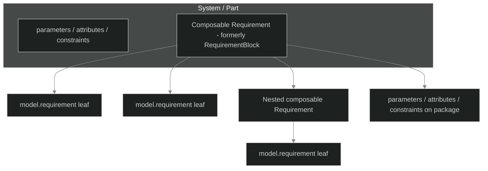
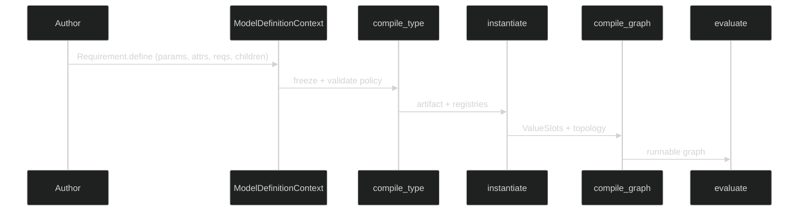

# Implementation plan — composable `Requirement` type (DSL / Neo4j alignment)

**Status:** Draft for review  
**Audience:** Implementers, reviewers, documentation owners, and ThunderGraph product integration  
**Related instructions:** Repository root [`implementation_plan_instructions.md`](../../../implementation_plan_instructions.md)  
**Related design context:** Monorepo [`docs/dsl_integration/01_neo4j_persistence_and_incremental_projection.md`](../../../docs/dsl_integration/01_neo4j_persistence_and_incremental_projection.md) (projection and identity; optional naming alignment)

---

## Table of contents

1. [Purpose and scope](#1-purpose-and-scope)
2. [Design philosophy](#2-design-philosophy)
3. [Methodology](#3-methodology)
4. [Goals and non-goals](#4-goals-and-non-goals)
5. [Conceptual model](#5-conceptual-model)
6. [Technical approach and open decisions](#6-technical-approach-and-open-decisions)
7. [Architecture](#7-architecture)
8. [File tree architecture](#8-file-tree-architecture)
9. [Phased delivery and GO / NO-GO gates](#9-phased-delivery-and-go--no-go-gates)
10. [Test plan](#10-test-plan)
11. [Documentation, examples, and notebooks](#11-documentation-examples-and-notebooks)
12. [Risks and mitigations](#12-risks-and-mitigations)
13. [Document history](#13-document-history)
14. [References](#14-references)

---

## 1. Purpose and scope

**Purpose:** Align the ThunderGraph Model DSL with systems-engineering and product expectations: a **composable requirement element** should be named and behave like **composition** (analogous to `Part`), not a special-case “block.” The type authors subclass should read as **`Requirement`**, and its `define()` surface should allow the same **structural richness** as other elements where it is semantically valid—nested requirements, local parameters, derived attributes, and constraints—so that executable acceptance can depend on **requirement-local** structure without forcing everything through `allocate` wiring alone.

**Product driver:** Commercial ThunderGraph persistence (Neo4j) already treats **attributes, ports, actions, and similar concepts as their own element nodes**, not as a large property bag on Part or Requirement. The DSL should **read naturally** next to that graph model and reduce translation friction for projection and incremental merge workstreams.

**In scope:**

- Rename the composable authoring type from **`RequirementBlock`** to **`Requirement`** (final spelling subject to gate in §6).
- Rename or supersede **`model.requirement_block(...)`** with an API that mirrors **`model.part(...)`**-style composition (exact method name is a gated decision).
- Relax compile-time policy so a composable **`Requirement`** type may declare, within **`define()`**, at least: nested **`model.requirement(...)`**, nested composable children (today’s nested blocks), **`model.parameter(...)`**, **`model.attribute(...)`**, **`model.constraint(...)`**, and the existing requirement-specific helpers (**`requirement_input`**, **`requirement_attribute`**, **`requirement_accept_expr`**, **`citation`**, **`references`**) where still appropriate.
- **End-to-end plumbing:** definition context, compile validation, **`ConfiguredModel` / `ValueSlot` instantiation**, symbol ownership and path prefixing (including nested requirement scopes), and **graph compilation** so expressions resolve correctly under the new scopes (including edge cases similar to “attribute on child referenced root parameters”).
- **Breaking change management:** deprecation shims versus hard cut, changelog, migration notes for downstream repos.
- **User documentation, Sphinx API docs, examples, notebooks, and tests** updated to the new API.

**Out of scope (unless a later phase rescopes):**

- Changing Neo4j **neomodel** class definitions in `common/models` (that remains a separate integration track; this plan only aligns **DSL naming and structure** to ease projection).
- Rewriting the **evaluation engine’s** internal identity scheme (**`stable_id`**) or storage keys.
- Automatic migration tooling for **saved graphs** or **serialized compilation artifacts** outside this repository (call out as follow-up if needed).

---

## 2. Design philosophy

| Principle | How it shows up |
|-----------|------------------|
| **Simpler, more elegant, easier to understand** | One composable story: **requirements compose like parts compose**; names match author mental models and product vocabulary. |
| **SOLID** | Keep **compilation**, **instantiation**, and **graph building** as separate responsibilities; extend each through small, testable validators and resolvers rather than monolithic special cases. |
| **Small, single-purpose functions** | Separate “what node kinds are allowed in this owner,” “how symbols thread through nested scopes,” and “how slots appear on `ConfiguredModel`” into focused helpers. |
| **Meet requirements** | GO gates are **pytest**, **pyright/ruff** (per repo policy), **Sphinx** (if applicable), and **nbconvert** for touched notebooks. |

---

## 3. Methodology

**Specification before churn:** Lock **public names** and **deprecation policy** early (Phase 0 gate) so documentation and examples are not rewritten twice.

**Inside-out:** Implement **compiler and runtime** correctness first (definition → compile → instantiate → graph compile → evaluate), then **docs and demos**.

**Observation equivalence:** Where shims exist, **behavior** of existing models under the old names should match the new implementation until the shim is removed.

**Adversarial review:** After core phases, a dedicated review pass on **symbol resolution** and **nested requirement scopes** (historically sensitive areas).

---

## 4. Goals and non-goals

**Goals**

- Authors can write **`class SenseCapability(Requirement):`** and in **`define()`** use **`model.requirement(...)`**, **`model.parameter(...)`**, **`model.attribute(...)`**, **`model.constraint(...)`**, and nested composable requirements, subject to validated rules.
- **Neo4j-friendly mental model:** composable requirement subtree corresponds to a **subgraph root**; parameters and attributes become **first-class element nodes** in projection, not fake columns on a fat node.
- **Documented migration** from **`RequirementBlock` / `requirement_block`** to the new API.

**Non-goals**

- Promising **bit-for-bit** equality of every internal serialized field name in compiled artifacts (internal schema may evolve if tests and tooling agree).
- Solving **full incremental Neo4j merge** in this plan (only naming and DSL structure alignment).

---

## 5. Conceptual model

**Today (simplified):**

- **`Part` / `System`:** full structural surface (parameters, attributes, constraints, nested parts, …).
- **`RequirementBlock`:** intentionally **narrow** surface: mostly requirements, nested blocks, requirement inputs/attributes, citations—**not** general parameters/attributes/constraints on the block itself.

**Target:**

- **`Requirement`:** composable **requirement package** (namespace) analogous to **`Part`**: may contain **child requirements**, **child composable requirement types**, and **local value structure** (parameters, derived attributes, constraints) that support complex acceptance logic.

**Leaf vs composable (unchanged idea, clearer naming):**

- **`model.requirement(name, text, ...)`** remains the declaration of a **single requirement statement** (leaf node in the definition tree).
- The **composable class** is the **container** authors subclass for grouping and reuse—renamed to **`Requirement`**.



---

## 6. Technical approach and open decisions

**6.1 Naming (Phase 0 — must decide before wide doc rewrites)**

- **Class rename:** `RequirementBlock` → `Requirement`.
- **Registration method:** `model.requirement_block(name, Type)` → new name. Options to compare for symmetry with `model.part` and collision avoidance with `model.requirement(...)`:
  - **`model.requirement_package(name, Type)`**
  - **`model.composed_requirement(name, Type)`**
  - **`model.requirement_module(name, Type)`**
  - Keep **`requirement_block`** as a deprecated alias only.
- **Ref types:** `RequirementBlockRef` → **`RequirementRef`** (or **`ComposableRequirementRef`**) and update **dot-navigation** ergonomics in `tg_model.model.refs`.
- **Internal node kind string** (`"requirement_block"` in declarations): either **retain** for storage compatibility with a comment mapping table, or **rename** with a documented breaking change in internal artifacts—decision tied to whether any external persistence depends on the string.

**6.2 Policy matrix (what a composable `Requirement` may declare)**

- Start from **today’s allow-list** in compile validation and **extend** with `parameter`, `attribute`, `constraint` (and any related edge kinds those imply).
- Re-validate rules for **edges** currently restricted to `references` on requirement blocks: constraints and attributes may introduce **additional allowed edge kinds** or reuse existing mechanisms—resolve during implementation without widening accidentally (e.g., stray `connect` on requirement packages if invalid).

**6.3 Symbol ownership and path prefixing**

- Today, requirement blocks thread **symbol anchor** and **path prefix** for requirement inputs. Extending with **parameters and attributes** on the composable type requires a clear rule: **which symbols are visible** inside nested `attribute` expressions and **`requirement_accept_expr`**, and how **`parameter_ref`** resolves from nested scopes (mirror the lessons from root-vs-child part compilation).

**6.4 Instantiation and `ConfiguredModel`**

- Ensure **ValueSlots** for new parameters/attributes on composable requirement types appear on the configured instance (and remain valid keys for **`evaluate`** where applicable).
- Nested **`Requirement`** instances: preserve **deterministic stable identities** and **hierarchical field access** consistent with existing **`Part`** patterns.

**6.5 Backward compatibility**

- **Preferred for downstream shock absorption:** one release with **`RequirementBlock = Requirement`** (alias) and **`requirement_block = <new_method>`** deprecated wrappers emitting **`DeprecationWarning`**, then removal in a semver-major bump.
- **Alternative:** hard rename in one major version with a short migration guide only—acceptable if product timeline demands it; explicit GO decision.

---

## 7. Architecture

**7.1 Compile pipeline touchpoints**

- **`tg_model.model.elements`:** class rename and docstrings.
- **`tg_model.model.definition_context`:** registration method(s), ref types, any path-walking helpers that mention `requirement_block`.
- **`tg_model.model.compile_types`:** `_validate_requirement_block_if_needed` generalized to **composable requirement policy**; recursive compile for nested types; symbol threading; any path resolution walking **`requirement_block` / renamed kind**.
- **`tg_model.execution.configured_model` (and related):** instantiate nested requirement subtrees and attach **slots** for new declarations.
- **`tg_model.execution.graph_compiler` (and validation):** ensure new slots participate in dependency edges and **expression resolution** under correct scope.

**7.2 Conceptual flow (Mermaid, dark)**



---

## 8. File tree architecture

**Primary package (indicative, not exhaustive):**

```text
thundergraph-model/
  tg_model/
    model/
      elements.py                 # Requirement (renamed), exports
      definition_context.py       # registration API, refs, path logic
      compile_types.py            # validation, recursion, symbol threading
      refs.py                     # RequirementRef / navigation types
    execution/
      configured_model.py         # instantiation of new slots under requirement scopes
      graph_compiler.py           # resolution + edges for new declarations
      validation.py               # any graph-level rules affected
    ...
  tests/
    unit/                         # policy, refs, symbol resolution
    integration/                  # end-to-end evaluate on updated examples
  examples/
    commercial_aircraft/
    hpc_datacenter/
  notebooks/
  docs/
    user_docs/                    # user + developer guides
    generation_docs/              # this plan
```

**Also update:** `CHANGELOG.md`, Sphinx sources under `docs/` (if autodoc targets rename), and any **type stubs** or **public `__all__`** lists.

---

## 9. Phased delivery and GO / NO-GO gates

| Phase | Deliverable | GO criteria |
|-------|-------------|-------------|
| **0 — Naming and compatibility contract** | Decision record: class name, registration method name, ref rename, internal `kind` string strategy, deprecation vs hard break | Reviewers agree; no parallel naming experiments in docs |
| **1 — Core model types and definition API** | `Requirement` class, new registration method, updated refs; shims if chosen | Unit tests for definition registration and path navigation |
| **2 — Compile policy extension** | Composable `Requirement` may declare parameter/attribute/constraint; validators updated | Unit tests for allowed/forbidden declarations; error messages actionable |
| **3 — Instantiate + graph compile** | Slots on `ConfiguredModel`; graph resolves expressions in nested scopes | Integration tests: instantiate + `compile_graph` + `evaluate` on focused fixtures |
| **4 — Regression sweep** | All existing tests green; pyright/ruff clean per project config | Full `pytest` + static checks |
| **5 — Examples and integration tests** | `commercial_aircraft`, `hpc_datacenter`, and any other first-party examples migrated | Integration tests and example README commands verified |
| **6 — User documentation** | Quickstart, mental model, concepts, FAQ reflect composition model and migration | Tech writer / reviewer sign-off |
| **7 — Developer documentation** | `extension_playbook`, `architecture`, `testing`, `repository_map` | Cross-links consistent; facade vs explicit pipeline unchanged in intent |
| **8 — Sphinx / API HTML** | Autodoc entries for renamed types and methods; warning-clean build | `sphinx-build` (or project wrapper) clean |
| **9 — Notebooks** | All affected notebooks use new names; `nbconvert --execute` passes | CI or documented manual gate |
| **10 — Deprecation removal (optional follow-up)** | Remove shims in next major | Release notes and consumer migration complete |

**NO-GO:** Any phase that leaves **examples** on old names while **user docs** claim only the new API, or that ships **ambiguous** symbol resolution for requirement-local parameters.

---

## 10. Test plan

**Unit tests (description)**

- **Policy enforcement:** composable `Requirement` types reject declarations that should remain invalid (e.g., inappropriate edge kinds if still disallowed).
- **Ref and path resolution:** dot-access from system root into nested composable requirements and leaves matches compile-time expectations.
- **Symbol threading:** `parameter_ref` and attribute expressions resolve correctly when parameters live on composable requirement types and when nested children reference parent-package symbols.

**Integration tests (description)**

- **Smoke:** Instantiate a small system that uses **parameters and attributes on a composable requirement**, nested composable children, and **evaluate** with handle-based inputs; assert **pass/fail** and key outputs.
- **Regression:** Existing aircraft and datacenter scenarios updated to the new API behave as before (same numerical results and satisfaction outcomes for equivalent models).
- **Negative cases:** Mis-wired allocate inputs or invalid expressions produce **clear compile-time** (or validate-time) failures without silent wrong graphs.

**Manual / notebook gates**

- Execute updated notebooks headlessly; spot-check prose matches the **composition** mental model.

---

## 11. Documentation, examples, and notebooks

**User-facing (`docs/user_docs/`)**

- **Quickstart:** show **`Requirement`** composition alongside **`Part`** composition; one short sidebar on **leaf** `model.requirement` vs **composable** subclass.
- **Mental model / concepts:** explain **requirement package** as a namespace with **its own parameters and attributes**; tie to Neo4j “attributes as nodes” without implying schema changes in this repo.
- **FAQ:** migration from `RequirementBlock`, why the rename happened (product alignment).

**Developer-facing**

- **extension_playbook / architecture:** update type names, registration calls, and any diagrams mentioning `RequirementBlock`.
- **Testing:** guidance for adding regressions that cover **nested requirement scopes**.

**Examples and notebooks**

- **`examples/commercial_aircraft/`** and **`examples/hpc_datacenter/`:** rename imports, base classes, and `model.*` registration calls; keep **evaluate** façade patterns unchanged.
- **`notebooks/`:** align narrative and imports; optional short “migration from RequirementBlock” cell if helpful.

**CHANGELOG**

- **Breaking change** section with before/after table and shim timeline (if any).

---

## 12. Risks and mitigations

| Risk | Mitigation |
|------|------------|
| **Large downstream break** | Deprecation shims for one release; clear migration table |
| **Subtle symbol / scope bugs** | Focused unit tests + adversarial review; fixture modeled on past part/root scope issues |
| **Documentation drift** | Docs phases gated after examples; single source of truth in docstrings |
| **Name collision confusion** (`Requirement` class vs `model.requirement`) | User docs explicitly distinguish **composable type** vs **leaf declaration** |

---

## 13. Document history

| Date | Change |
|------|--------|
| 2026-03-27 | Initial draft from product integration and DSL/Neo4j alignment discussion |
| 2026-03-27 | **Phases 0–1 (implemented):** **Decision record:** composable type is **`Requirement`** with **`RequirementBlock = Requirement`**; registration is **`requirement_package`** with **`requirement_block` → `DeprecationWarning`** shim; refs are **`RequirementRef`** with **`RequirementBlockRef = RequirementRef`**; internal node **`kind`** string stays **`requirement_block`**. Examples, concepts doc, extension playbook, AEV notebook, and unit tests updated. |
| 2026-03-27 | **Advisor follow-up:** **`CHANGELOG`** section order fixed; user/draft docs + **`v0_api`** aligned to **`Requirement` / `requirement_package`**; **`requirement_ref`** error strings use author-facing “composable package” wording; **`compile_type`** documents **`cls_mut: Any`**; **`cargo_jet_program`** notebook notes historical module filename; end-to-end test for deprecated **`requirement_block`** shim; **`PYTHONWARNINGS`** note in FAQ/CHANGELOG. |
| 2026-03-27 | **Phase 2 (implemented):** **`_validate_requirement_block_if_needed`** allow-list extended with **`parameter`**, **`attribute`**, **`constraint`**; edges still **`references`** only; **`Requirement`** class docstring updated; unit tests for allowed compile + forbidden **`state`**. |
| 2026-03-27 | **Advisor “should” follow-up (Phase 2):** Docstring notes shared **`ModelDefinitionContext`** vs edge rejection; **`_validate_requirement_package_value_exprs`** for package **`attribute`**/**`constraint`** symbols; tests for **`port`**, **`allocate`**, foreign **`parameter_ref`**, undeclared slot ref; **`Requirement`** docstring clarifies compile vs runtime (Phase 3) for package value nodes. |
| 2026-03-27 | **Phase 3 (implemented):** **`parameter`**/**`attribute`** inside packages use **`symbol_owner`** + **`symbol_path_prefix`** for **`AttributeRef`** (via **`ModelDefinitionContext._value_ref_for_current_owner`**); **`RequirementPackageInstance`** on **`PartInstance`** with **`add_requirement_package`** / dot access; **`_instantiate_requirement_block_children`** creates package **`ValueSlot`**s and constraint **`ElementInstance`**s; **`compile_graph`** runs **`_compile_requirement_package_tree`** (slots via **`_compile_slot(..., model.root, ...)`**, constraints via **`_resolve_symbol_to_slot`** from root); integration test **`test_requirement_package_instantiate_graph_evaluate`**; **`tg_model.execution.RequirementPackageInstance`** export. |
| 2026-03-27 | **Advisor Phase 3 “should” follow-up:** package **`constraint`** **`expr=None`** rejected at compile; symbol-free package constraints get graph handlers plus an anchor edge from a package **`ValueSlot`** (avoids orphaned compute nodes in **`validate_graph`**); nested outer/inner package **`evaluate`** test (inner references outer parameter via closure); **`cm.evaluate`** with **`ValueSlot`** keys in existing test; **`slot_ids_for_part_subtree`** walks requirement packages with **`getattr(..., "_child_lookup", None)`** for **`ConfiguredModel`**-as-“part” callers; **`_alloc_target_as_part`** replaces bare **`cast`** in requirement-attribute compile; **`Requirement`** docstring notes package-slot limits. |
| 2026-03-27 | **Phase 4 (implemented):** Regression sweep — full **`pytest`** green; **`uv run pyright`** clean repo-wide; **`ruff check tg_model tests`** + **`ruff format tg_model tests`** clean. Behavior tests pass **`PartInstance`** (**`cm.root`**) into **`dispatch_*`**; **`test_configured_model`** narrows **`PartInstance`** before port/slot access; **`RequirementRef.__getattr__`** annotated **`Ref \| RequirementRef`**; nested package test uses **`isinstance`** on **`inner`**; **`solve_groups`** builds **`dict[Symbol, Unit]`** with explicit **`None`** check; analysis async compare test narrows optional values; **`model_prototype_sketch`** uses **`cast(PortRef, …)`** for **`connect`**; line-length / **`ValueSlot.__slots__`** / import-order fixes from **`ruff --fix`**. |
| 2026-03-28 | **Phase 5 (implemented):** Examples aligned with composable **`Requirement`** naming — **`program/l1_requirement_blocks.py`** renamed to **`l1_requirement_packages.py`** (imports, **`README`**, **`IMPLEMENTATION_PLAN`**, reporting comment, **`cargo_jet_program`**, **`notebooks/cargo_jet_program.ipynb`**). New **`examples/hpc_datacenter/README.md`** (PYTHONPATH, **`evaluate`**, test command, notebook link). Integration test **`test_hpc_datacenter_compiles_requirement_package_subtree`** validates nested **`requirement_block`** / leaf **`requirement`** structure on compiled artifacts. |
| 2026-03-28 | **Phase 6 (implemented):** User docs — **`quickstart`**: composable **`Requirement`** + **`requirement_package`** beside **`Part`**, package-level parameter example, sidebar **leaf `model.requirement`** vs **composable subclass**. **`mental_model`**: requirement package as namespace (package-level **`parameter`**/**`attribute`**/**`constraint`**), graph/Neo4j mental model without schema claims. **`concepts_requirements`**: same distinctions, package-level slots + limitations pointer. **`faq`**: migration table **`RequirementBlock`**/**`requirement_block`** → canonical names, **`PYTHONWARNINGS`**. |
| 2026-03-28 | **Phase 7 (implemented):** Developer docs — **`extension_playbook`**: **`requirement_package`** / **`RequirementRef`**, package-level declarations + limits, internal **`kind`** **`requirement_block`** note; cross-links to user **`concepts_requirements`** / **`faq`**. **`architecture`**: composable requirement packages (runtime topology, shared graph cache, artifact naming). **`testing`**: nested-scope / package regression guidance and pointer to **`tests/unit/model/test_requirement_block.py`**. **`repository_map`**: examples terminology, reading order includes concepts page, source trail includes **`compile_types.py`**. |
| 2026-03-28 | **Phase 8 (implemented):** Sphinx / API HTML — **`api/index`**: explicit **Composable requirements** cross-reference map (**`Requirement`**, **`requirement_package`**, **`RequirementRef`**, **`RequirementPackageInstance`**, shims). Autodoc already surfaces renamed symbols via **`tg_model.model`** / **`tg_model.execution`** **`automodule`** pages; **`sphinx-build -W`** verified. **`releasing`** / **`contributing`**: document **`uv run --group docs sphinx-build -W …`** as the docs gate. |
| 2026-03-28 | **Phase 9 (implemented):** Notebooks — prose/code in **`autonomous_electric_vehicle`** / **`cargo_jet_program`** aligned to **package** vocabulary and internal **`kind`** **`requirement_block`**; **`nbconvert --execute --inplace`** verified for all **`notebooks/*.ipynb`** ( **`dev`** group). **`developer/testing`**: **Notebooks** section with headless execute command. |
| 2026-03-28 | **Phase 10 (implemented):** **0.2.0** removes public shims **`RequirementBlock`**, **`RequirementBlockRef`**, **`ModelDefinitionContext.requirement_block`**. **`CHANGELOG`**, **`README`**, user/draft docs, **`api_root`** exclude list, tests, and **`pyproject`** version bump. Internal compiled **`kind`** **`requirement_block`** retained. |

---

## 13a. Phase 0 decision record (superseded by Phase 10 for shims)

| Topic | Decision |
|-------|-----------|
| Composable class name | **`Requirement`** (canonical). **`RequirementBlock`** was a temporary alias (**removed in 0.2.0**). |
| Registration API | **`requirement_package(name, package_type)`**. **`requirement_block`** was a deprecated method (**removed in 0.2.0**). |
| Ref type | **`RequirementRef`**. **`RequirementBlockRef`** was a temporary alias (**removed in 0.2.0**). |
| Internal / serialized **`kind`** | Keep **`requirement_block`** (no artifact migration in this phase). |
| **`model.requirement(...)`** (leaf) | Unchanged — distinct from the **`Requirement`** **type** used for composition. |

---

## 14. References

- Repository root [`implementation_plan_instructions.md`](../../../implementation_plan_instructions.md)
- [`evaluation_api_facade_implementation_plan.md`](./evaluation_api_facade_implementation_plan.md) (evaluator façade; complementary, not superseded)
- Monorepo [`docs/dsl_integration/README.md`](../../../docs/dsl_integration/README.md) and [`01_neo4j_persistence_and_incremental_projection.md`](../../../docs/dsl_integration/01_neo4j_persistence_and_incremental_projection.md)
