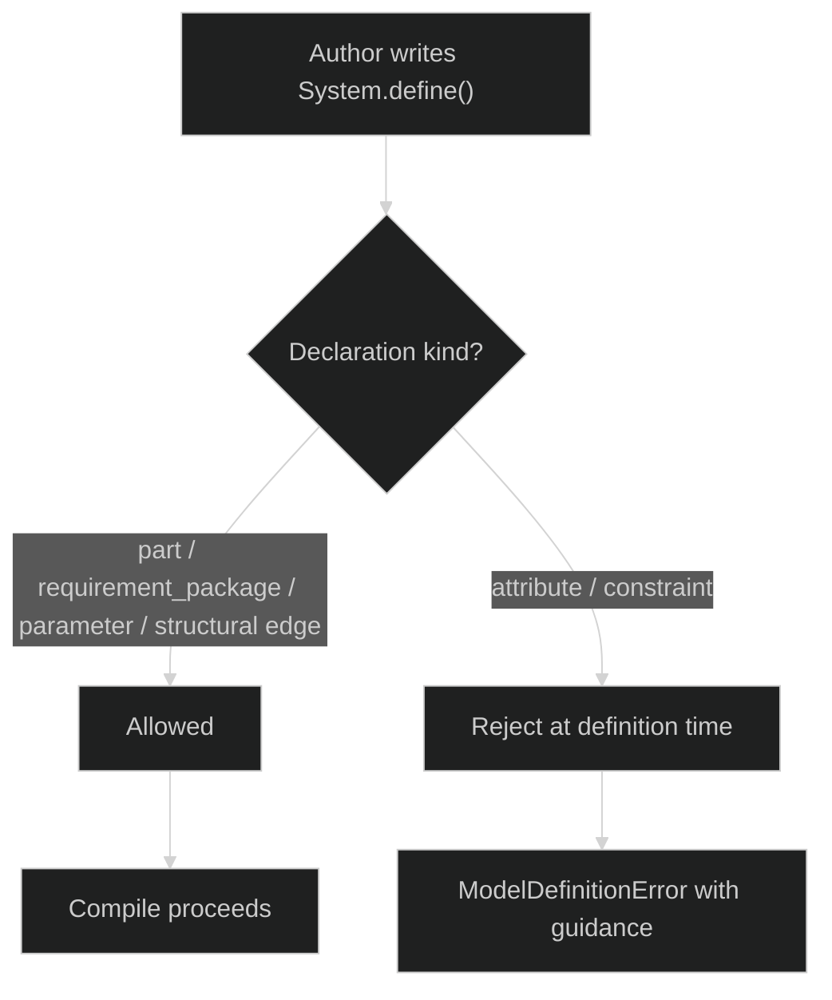

# Implementation Plan - Restrict `System` Authoring To Composition And Inputs

**Status:** Draft for review  
**Audience:** `tg-model` implementers, model authors, documentation owners, and reviewers  
**Related instructions:** Repository root [`implementation_plan_instructions.md`](../../../implementation_plan_instructions.md)

## Table of contents

1. [Purpose](#1-purpose)
2. [Design philosophy](#2-design-philosophy)
3. [Methodology](#3-methodology)
4. [Problem statement](#4-problem-statement)
5. [Target authoring rule](#5-target-authoring-rule)
6. [Architecture and rationale](#6-architecture-and-rationale)
7. [File tree architecture](#7-file-tree-architecture)
8. [Phased delivery and GO / NO-GO gates](#8-phased-delivery-and-go--no-go-gates)
9. [Migration strategy](#9-migration-strategy)
10. [Test plan](#10-test-plan)
11. [Risks and mitigations](#11-risks-and-mitigations)
12. [References](#12-references)

## 1. Purpose

This plan proposes a deliberate tightening of the `tg-model` DSL:

- `System.define()` should remain the place for **system composition** and **top-level inputs**
- `Part.define()` should own **derived values** and **executable design logic**
- `Requirement.define()` should own **acceptance logic** and **traceability**

The core goal is to make the DSL more MBSE-disciplined and harder for humans or AI assistants to misuse.

Today, `System` classes can define `attribute(...)` and `constraint(...)` the same way `Part` classes can. That flexibility is convenient, but it also makes it easy to create root-heavy "god systems" where local part semantics, geometry, and validation logic accumulate at the top level. That authoring style weakens semantic ownership and encourages poor model structure.

This plan restricts `System` authoring for the right reason: to make the default DSL shape push authors toward cleaner, compositional, system models.

## 2. Design philosophy

This plan follows the ThunderGraph design philosophy directly:

| Principle | How it applies here |
|-----------|---------------------|
| Simpler and more elegant architectures are best | A `System` should read like architecture composition, not a mixed bag of geometry equations and local validity rules. |
| SOLID matters | Derived values and checks should live with the element that owns them. This improves single responsibility and local reasoning. |
| Small, focused functions and modules | Logic should move into narrowly scoped `Part` and `Requirement` definitions rather than one huge root definition block. |
| Build the simplest thing that works | Enforce one simple rule in the core DSL instead of inventing complex style profiles or partial enforcement modes first. |

Additional posture for this plan:

- prefer semantic ownership over convenience
- make the right pattern the easy pattern
- reduce AI generation ambiguity by removing a bad-but-legal authoring path
- avoid product-specific policy layers when the library itself can express the architectural rule directly

## 3. Methodology

The implementation should proceed in five disciplined steps:

1. define the authoring rule precisely
2. audit and migrate first-party models that violate the future rule
3. add framework-level enforcement at declaration time only after first-party migrations are ready
4. align documentation, examples, and AI guidance with the enforced rule
5. lock the rule with tests and guidance so it does not regress

This must remain a small, readable change set at each phase. The work should avoid broad metaprogramming or special-case machinery. The framework already centralizes declaration-time recording in `ModelDefinitionContext`, so enforcement should be added there rather than scattered across runtime code.

The work should also be documentation-first in intent but framework-first in enforcement:

- docs and AI rules are necessary
- docs alone are not sufficient
- the library should reject the authoring shapes we now believe are architecturally wrong

## 4. Problem statement

The current DSL permits an author to place too much executable model semantics on the root `System`:

- local geometry calculations
- intrinsic part dimensions
- local part validity checks
- derived values used by only one subsystem
- coordination logic that would be cleaner as an explicit integration part

This creates several problems:

- semantic ownership becomes unclear
- root systems become oversized and harder to review
- parts become hollow shells that do not own their own meaning
- AI-generated models gravitate toward dumping everything in the root because it is the path of least resistance
- downstream product experiences become worse because the source no longer reflects a clean system decomposition

The official `tg-model` examples already show the failure mode this plan is meant to prevent. In particular, the `MarsNuclearTug` example currently uses root-level `sim_*` and `mission_*` attributes plus root-level coherence and sanity constraints to wire simulation outputs into the model. The plan must therefore cover not only simple derived-value migration, but also migration of a root-level external-compute integration pattern into an explicit owned part.

## 5. Target authoring rule

### 5.1 Rule to implement

Restrict `System.define()` so that it may not declare:

- `attribute(...)`
- `constraint(...)`

The default allowed `System` declarations should remain:

- `part(...)`
- `part()` / `root_block()` / `owner_part()` reference acquisition
- `requirement_package(...)`
- `requirement(...)` for legitimate system-level leaf statements when authors need them
- `parameter(...)` for top-level scenario, mission, or program inputs
- structural relations such as `connect(...)`, `allocate(...)`, and `references(...)`
- citations and other metadata-bearing declarations that do not undermine semantic ownership

### 5.2 Architectural interpretation

Under this rule:

- the `System` defines the architecture boundary and top-level inputs
- parts own derived engineering values and local checks
- requirements own acceptance and traceability
- cross-part logic is represented by explicit parts rather than hidden at the root

### 5.3 Out of scope for this plan

This plan does **not** propose:

- restricting `System.parameter(...)`
- restricting `Part.attribute(...)` or `Part.constraint(...)`
- changing the current `Requirement` package pattern
- redesigning execution, graph compilation, or evaluation APIs
- introducing a separate "strict mode" profile as the first step

The intent is to solve the specific DSL looseness that encourages bad system-level authoring.

### 5.4 Consequence for cross-hierarchy references

This restriction has an immediate consequence for cross-hierarchy reference semantics:

- `parameter_ref(SystemType, "...")` remains valid because `System.parameter(...)` remains legal
- `attribute_ref(SystemType, "...")` can no longer be relied on as a general authoring pattern once `System.attribute(...)` is forbidden

That means the migration plan shall assume:

- any existing or future need for a root-owned derived value must be replaced by an explicit owned part
- nested authorship that previously might have targeted a root-level derived value must instead target a part-owned attribute
- the implementation work shall include an audit of any uses or documentation of `attribute_ref(...)` that implicitly assume root-system attributes remain available

The goal is to avoid landing the restriction while leaving an orphaned reference pattern behind.

## 6. Architecture and rationale

### 6.1 Conceptual flow



### 6.2 Why declaration-time enforcement is the right layer

The wrong place to enforce this rule would be:

- during graph compilation
- during runtime evaluation
- only in documentation
- only in AI rules

The right place is declaration recording in `ModelDefinitionContext`, because that is where the DSL surface is defined today. It already knows the `owner_type` and can distinguish `System`, `Part`, and `Requirement`.

That gives the implementation several benefits:

- a single enforcement point
- fast feedback to authors
- simple error messages
- no runtime cost
- no hidden "sometimes legal" behavior after compilation

### 6.3 Why a hard restriction is justified

A warning-only path will not be enough if the goal is to prevent AI and hurried authors from producing low-quality models. If the DSL allows the pattern, it will keep being used.

This is one of the rare cases where reducing flexibility improves the library:

- it narrows the semantic surface
- it improves consistency across models
- it pushes authors toward explicit ownership and composition
- it makes reviews easier because the root system becomes predictable

### 6.4 Expected authoring replacement pattern

When a model currently puts derived values or checks on the `System`, the replacement should usually be one of these:

- move the logic into the part that owns it
- add a new dedicated integration/coupling part under the root
- keep only truly top-level inputs on the root
- keep acceptance statements in `Requirement` packages, not on the system

The plan should make that replacement pattern explicit in docs and examples so users do not interpret the restriction as arbitrary.

## 7. File tree architecture

Primary touchpoints for this change:

```text
thundergraph-model/
├── tg_model/
│   └── model/
│       ├── definition_context.py        # enforce illegal System.attribute / System.constraint
│       ├── elements.py                  # clarify System authoring contract in docstrings
│       └── __init__.py                  # only if public messaging/docs need export-level notes
├── tests/
│   ├── unit/
│   │   └── model/
│   │       └── test_definition_context.py
│   └── integration/
│       ├── structural_models/           # enforce authoring failures and migrated examples
│       └── evaluation/                  # confirm migrated models still execute correctly
├── docs/
│   └── generation_docs/
│       └── system_authoring_restrictions_implementation_plan.md
├── docs/user_docs/
│   ├── user/                            # overview, quickstart, concepts
│   ├── developer/                       # extension playbook if needed
│   └── api/                             # Sphinx/autodoc reflects updated docstrings
├── examples/                            # migrate any root-heavy examples
```

## 8. Phased delivery and GO / NO-GO gates

### Phase 1. Decide and document the rule

**Objective:** Lock the target authoring contract before code changes begin.

**Work:**

- define the exact allowed and forbidden declarations for `System`
- confirm that `parameter(...)` stays legal on `System`
- document the architectural reason for the restriction
- identify first-party models that currently violate the future rule

**GO / NO-GO gate:**

- the team agrees the library should hard-reject `System.attribute(...)` and `System.constraint(...)`
- there is a written migration target for first-party models
- there is no unresolved ambiguity about whether to ship a warning-only mode first

### Phase 1 output: decision record and current audit snapshot

Phase 1 establishes the following decisions:

- `System.attribute(...)` shall become illegal
- `System.constraint(...)` shall become illegal
- `System.parameter(...)` shall remain legal for top-level scenario, mission, and program inputs
- `System.requirement(...)` shall remain legal for explicit system-level requirement statements
- enforcement shall be hard rejection in the library rather than warning-only guidance
- first-party migration shall happen before enforcement is turned on

Current `tg-model` audit snapshot at Phase 1:

| System | Current root-level forbidden shapes | Phase 1 assessment | Expected migration pattern |
|--------|-------------------------------------|--------------------|----------------------------|
| `thundergraph-model/examples/mars_ntp_tug/tug_model.py` | Root `sim_*`, `mission_*`, and coherence/sanity constraints | High-priority violation | Move mission sizing and napkin desk integration into an explicit mission-sizing/integration part |
| `thundergraph-model/examples/commercial_aircraft/program/cargo_jet_program.py` | Root mission-margin attribute and root constraints | Medium-priority violation | Move mission closure logic into an explicit program-analysis or mission-integration part |
| `thundergraph-model/examples/hpc_datacenter/program.py` | Root aggregate attribute and root constraint | Medium-priority violation | Move facility-level aggregate load logic into a dedicated facility-analysis part |

Phase 1 also identifies a follow-on semantic consequence that must be carried into implementation: any authoring pattern that assumes `attribute_ref(SystemType, "...")` for a root-derived value will need to migrate to a part-owned attribute path once the restriction is enforced.

### Phase 2. Audit and migrate first-party code before enforcement

**Objective:** Remove internal violations before the library hard-rejects the forbidden authoring patterns.

**Work:**

- audit `tg_model`, `examples`, tests, notebooks, and docs for root-level `System.attribute(...)` and `System.constraint(...)`
- migrate each violating `tg-model` example or official teaching artifact to one of the approved patterns:
  - move logic into existing parts
  - add a dedicated integration/coupling part
  - leave only top-level parameters on the root
- explicitly migrate representative high-visibility official examples including `MarsNuclearTug`, `CargoJetProgram`, and `HpcDatacenterProgram`
- for `MarsNuclearTug`, move the current root-level `sim_*` / `mission_*` external-compute outputs and their coherence constraints into an explicit owned integration part rather than leaving simulation wiring at the root
- update examples and notebooks so they teach the new discipline before enforcement lands

**GO / NO-GO gate:**

- first-party example code no longer relies on forbidden root declarations
- migrated models still compile and evaluate
- no public-facing example contradicts the new rule
- the migration audit has explicitly resolved the `MarsNuclearTug` external-compute pattern and any `attribute_ref(SystemType, ...)` assumptions

### Phase 3. Add framework enforcement

**Objective:** Make the library reject the forbidden authoring patterns after first-party migrations are ready.

**Work:**

- add declaration-time checks in `ModelDefinitionContext.attribute(...)`
- add declaration-time checks in `ModelDefinitionContext.constraint(...)`
- detect when `owner_type` is a `System`
- raise `ModelDefinitionError` with direct guidance, for example:
  - `System.define() may not declare attribute(...); move the value to a Part or Requirement package`
  - `System.define() may not declare constraint(...); move the check to a Part or Requirement package`
- update relevant docstrings so the restriction is visible in API docs
- update or replace existing positive-path unit tests that currently call `ModelDefinitionContext(System).attribute(...)` or `constraint(...)` so the suite matches the new contract

**GO / NO-GO gate:**

- unit tests prove illegal `System` declarations fail immediately
- legal `Part` and `Requirement` declarations still work unchanged
- error messages are specific enough to teach the replacement pattern
- first-party migrated models remain green after enforcement is turned on

### Phase 4. Align docs, Sphinx, and AI guidance

**Objective:** Make the restriction obvious everywhere authors learn the DSL.

**Work:**

- update user docs to state that `System` is for composition and top-level inputs
- update developer docs to explain where cross-part logic should live
- update `System` and `ModelDefinitionContext` docstrings so Sphinx reflects the new contract
- update AI rules and authoring guidance to forbid root-level system attributes and constraints
- add at least one "before vs after" example showing a root-heavy model refactored into owned parts

**GO / NO-GO gate:**

- Sphinx HTML docs rebuild cleanly
- no first-page docs still present the old root-heavy pattern as normal
- AI guidance matches the enforcement in code

### Phase 5. Lock the rule with regression coverage

**Objective:** Prevent the DSL from drifting back toward permissive root-level authoring.

**Work:**

- add regression tests around forbidden `System` declaration shapes
- add integration coverage for migrated representative models
- add repository searches or CI checks for obvious forbidden examples if useful
- ensure docs/examples remain aligned in future PRs

**GO / NO-GO gate:**

- failing cases remain failing
- representative migrated models remain healthy
- CI covers both enforcement and successful replacement patterns

## 9. Migration strategy

The migration should prefer architectural clarity over clever compatibility shims.

### 9.1 Default migration recipe

For each root-level `System.attribute(...)` or `System.constraint(...)`:

1. decide which element actually owns the logic
2. move it into that existing part when ownership is obvious
3. if ownership spans multiple parts, create a dedicated integration part
4. keep the root focused on composition and top-level input parameters
5. keep requirement acceptance in requirement packages, not the root system

If the migrated logic was previously the target of a cross-hierarchy derived-value reference, the migration shall also replace any root-level `attribute_ref(SystemType, "...")` dependency with a part-owned reference path that matches the new ownership model.

### 9.2 Representative replacement patterns

Typical replacements should look like:

- local geometric envelope checks -> move into the relevant geometric part
- derived counts used by one subsystem -> move into that subsystem part
- cross-part consistency logic -> create an explicit integration part
- system reporting aliases -> only keep if they are top-level inputs; otherwise move under the owning part

For `MarsNuclearTug`, the representative replacement shall be:

- root-level napkin simulation outputs and mission aliases -> move into a dedicated mission-sizing or integration part
- root-level desk coherence constraints -> move into that same owned integration part
- downstream consumers that need those derived values -> reference the integration part's attributes rather than assuming root-system attributes

### 9.3 Migration posture

The plan should **not** preserve the old pattern via hidden compatibility switches.

If a first-party model becomes awkward under the new rule, that is a sign the model decomposition should improve.

## 10. Test plan

This section describes what should be tested. It intentionally does not provide test code.

### 10.1 Unit tests

Add or update unit tests to prove:

- `System.define()` cannot declare `attribute(...)`
- `System.define()` cannot declare `constraint(...)`
- existing tests that previously treated `ModelDefinitionContext(System).attribute(...)` or `constraint(...)` as legal have been updated to reflect the new contract
- `Part.define()` can still declare `attribute(...)` and `constraint(...)`
- `Requirement.define()` package-level authoring still works as intended
- the error messages point authors to the correct replacement pattern
- legal `System.parameter(...)` declarations still work
- other legal `System` declarations such as `part(...)` and `requirement_package(...)` remain unaffected

### 10.2 Integration tests

Add or update integration tests to prove:

- representative migrated models instantiate and evaluate successfully
- migrated official examples and notebooks still support their documented workflows
- examples and notebooks that previously leaned on root-heavy authoring still run after refactoring
- there is no hidden runtime path that recreates forbidden root-level attributes or constraints indirectly

### 10.3 Documentation and example validation

Validate:

- Sphinx docs rebuild cleanly and reflect the new contract
- notebooks and example packages execute successfully after migration
- no tutorial or quickstart reintroduces the old pattern

## 11. Risks and mitigations

| Risk | Why it matters | Mitigation |
|------|----------------|------------|
| Existing first-party models break immediately | Hard enforcement can create short-term friction | Land enforcement with a migration branch/sequence and do not call the work complete until first-party models are migrated |
| Some legitimate cross-part logic becomes awkward | Authors may feel forced into ceremony | Use explicit integration parts as the standard replacement instead of reopening root-level constraints |
| Users perceive the rule as arbitrary | Restrictive APIs create pushback if rationale is unclear | Explain the MBSE ownership model directly in docs and error messages |
| AI guidance lags the library change | Generated code may keep attempting forbidden patterns | Update AI rules and examples in the same effort, not as a later cleanup |
| Future contributors reintroduce permissive behavior | The DSL could drift back | Add targeted unit tests and example review expectations in CI |

## 12. References

- [`implementation_plan_instructions.md`](../../../implementation_plan_instructions.md)
- [`tg_model/model/definition_context.py`](../../tg_model/model/definition_context.py)
- [`tg_model/model/elements.py`](../../tg_model/model/elements.py)
- [`docs/generation_docs/v0_api.md`](./v0_api.md)
- [`examples/mars_ntp_tug/tug_model.py`](../../examples/mars_ntp_tug/tug_model.py)
