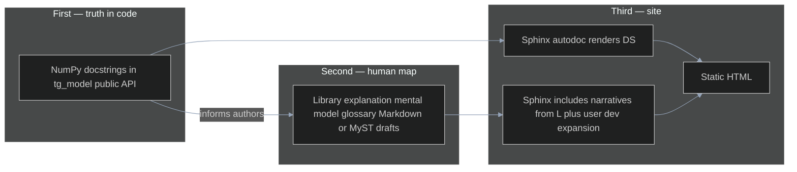
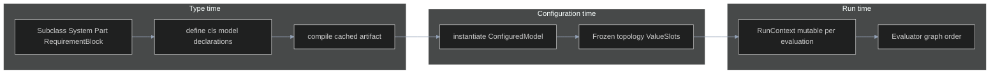

# ThunderGraph Model — user & developer documentation implementation plan

Repository-wide roadmap for **NumPy-style (numpydoc) docstrings** on `tg_model` **first**, then **authoritative explanations** of what the library is and does, then **Sphinx HTML** (API + narratives), and finally **hosting**. Order matters: you cannot explain the system well to users until the **public surface documents itself honestly** in code.

This does not replace example-specific plans (e.g. commercial aircraft); it links from them where useful.

---

## Table of contents

1. [Purpose and scope](#1-purpose-and-scope)
2. [Design philosophy applied to documentation](#2-design-philosophy-applied-to-documentation)
3. [Methodology and methods](#3-methodology-and-methods)
4. [Technical approach (decisions)](#4-technical-approach-decisions)
5. [Architecture](#5-architecture)
   - [Documentation information flow](#51-documentation-information-flow-mermaid-dark)
   - [Reader mental model vs library pipeline](#52-reader-mental-model-vs-library-pipeline-mermaid-dark)
6. [File tree architecture](#6-file-tree-architecture)
7. [Information architecture (site map)](#7-information-architecture-site-map)
8. [NumPy docstring standard](#8-numpy-docstring-standard)
9. [Sphinx configuration outline](#9-sphinx-configuration-outline)
10. [Phased delivery and GO / NO-GO gates](#10-phased-delivery-and-go--no-go-gates)
11. [Test plan](#11-test-plan)
12. [Hosting and release alignment](#12-hosting-and-release-alignment)
13. [Relationship to internal generation docs](#13-relationship-to-internal-generation-docs)
14. [Risks and mitigations](#14-risks-and-mitigations)
15. [References](#15-references)

---

## 1. Purpose and scope

**Purpose:** Anyone can build a **correct mental model** of ThunderGraph Model (what is declared at type time, what exists after instantiation, what mutates per run), use the **public API** confidently, and **extend** the library along **documented seams**—without reading every module.

### 1.1 Delivery order (non-negotiable)

Work proceeds in this sequence. **Skipping ahead is considered out of plan** unless a phase explicitly GOs a narrower exception.

| Step | What | Why |
|------|------|-----|
| **1** | **NumPy docstrings** on the **public** `tg_model` surface (incremental, module by module) | Forces precise language about behavior, failures, and lifecycle **at the source**. You learn what to teach while writing. |
| **2** | **Library explanation** — what the product **is**, what the **pipeline** is, shared **vocabulary** (Markdown/MyST in `docs/user_docs/` is fine **before** full Sphinx) | Narrative quality depends on insight from (1). This is “document WTF the library does” for authors and reviewers—not fluff. |
| **3** | **Sphinx + autodoc** — scaffold, theme, API reference that **renders** the docstrings from (1) and **includes** narratives from (2) | HTML is a **projection** of truth already written, not an empty shell waiting for content. |
| **4** | **User guide expansion** — quickstart, tutorials, cookbook, FAQ | Written when terminology and API contracts are stable from (1)–(3). |
| **5** | **Developer deep dives** — extension playbooks, architecture sequences | Same: after the surface and narratives exist. |
| **6** | **CI, warnings policy, hosting, branding** | Last mile; must not precede substantive content. |

**Scope:**

- **Docstrings (first):** NumPy format on the **public** surface of `tg_model`; private helpers minimal unless complex.
- **Library explanation (second):** Canonical prose for mental model, pipeline, glossary—feeds user and developer chapters.
- **Sphinx (third):** Autogenerated API + toctree for user/developer pages.
- **User documentation (fourth+):** install, tutorials, cookbook, FAQ, changelog intent.
- **Developer documentation (fifth+):** extension points, testing guide, contributing, releasing.

**Out of scope (for this plan):** Rewriting `docs/generation_docs/*` as the public manual; those files remain **internal / design / agent** context unless explicitly bridged.

**Audience:** Layered depth—after (1), the **API reference** is already useful in the IDE; after (3), it is useful on the web; narratives target humans who do not read every module.

---

## 2. Design philosophy applied to documentation

ThunderGraph engineering values apply directly to how documentation is produced:

| Principle | How it shows up in this plan |
|-----------|-------------------------------|
| **Simpler, more elegant, easier to understand** | One canonical HTML site; one docstring style; avoid parallel “wiki + PDF + random Markdown” unless there is a hard requirement. |
| **SOLID** | User vs developer toctrees **separate concerns**; API reference **single responsibility** (reference only); narratives own pedagogy. |
| **Small, single-purpose functions (and pages)** | Short chapters; one idea per page where possible; autodoc **curated** so generated pages are not endless flat lists. |
| **Meet requirements** | Success and GO gates are **testable** (build passes, links resolve, stated learning outcomes). |

Documentation work should **not** introduce unnecessary tooling sprawl: add dependencies only when they reduce long-term cost (Sphinx ecosystem is the anchor).

---

## 3. Methodology and methods

**Docstrings-first discipline:** The **first** documentation product is the **in-code contract** for the public API. Writing NumPy docstrings **before** polishing marketing-grade HTML avoids building a beautiful empty site and avoids user prose that **drifts from reality** because authors never forced themselves to state `Raises`, lifecycle, and preconditions clearly.

**Insight before pedagogy:** Step (2) in §1.1—“document WTF the library does”—is **deliberately after** a substantial docstring pass so explanations are **grounded** in what modules already say. If the prose cannot be written without contradicting docstrings, **fix the docstrings or the code**, not the other way around.

**Single source of truth:** Behavior is defined by **code + tests**; **public docstrings** are the **authoritative API description** for autodoc; narrative pages **explain and link**. When narrative and docstrings disagree, **resolve toward truth in code**; then align docstrings and prose in the same or follow-up change.

**Incremental slices by module:** Land docstrings in **merge-sized** chunks (e.g. one package or one high-traffic module per PR), each reviewable. Do not wait for a single “docstring apocalypse” PR.

**Separation of concerns:**

- **Docstrings** answer “what does this callable do, need, and throw?”
- **Library explanation (step 2)** answers “what is the whole system and how do pieces connect?”
- **User docs (later)** answer “how do I accomplish task X?”
- **Developer docs (later)** answer “where do I extend safely?”
- **generation_docs** remain historical / design input; canonical user-facing truth lives in **docstrings + user_docs**.

**Quality gates:** Each phase ends with an explicit **GO / NO-GO** (§10). NO-GO means fix scope or criteria—not silent deferral.

**Visual communication:** Use **Mermaid** diagrams (dark theme) for flows that prose obscures (§5).

**Limited code in this plan:** Describes **what** to build and **how to verify** it; no line-by-line prescriptions for `conf.py` or sources.

---

## 4. Technical approach (decisions)

| Topic | Decision |
|--------|-----------|
| Docstring convention | **NumPy** (numpydoc sections). |
| Static site | **Sphinx** with autodoc, autosummary, Napoleon (NumPy). |
| Narrative format | **MyST Markdown** preferred for guides; reST acceptable where Sphinx requires it. |
| API generation | Curated **autosummary** / autodoc, not indiscriminate dump of all private symbols. |
| Theme | **PyData Sphinx Theme** or **Furo**—pick one in **Phase 3** and keep it (accessibility, mobile, search). |

---

## 5. Architecture

### 5.1 Documentation information flow (Mermaid, dark)

**Intended order of work** (not “everything in parallel”). Docstrings and library explanation **precede** relying on Sphinx for insight.



**Later expansion:** tutorials, cookbook, developer deep dives, and hosting **attach** to the right side once the middle exists.

### 5.2 Reader mental model vs library pipeline (Mermaid, dark)

What user docs must make obvious:



---

## 6. File tree architecture

**Target layout** (incrementally created; `_build` excluded from VCS):

```text
thundergraph-model/
├── docs/
│   ├── generation_docs/              # internal design / agent context (existing)
│   └── user_docs/
│       ├── IMPLEMENTATION_PLAN.md    # this plan
│       ├── README.md                 # build instructions once Sphinx exists
│       ├── drafts/                   # optional: library explanation before full site (step 2)
│       ├── conf.py                   # appears in Phase 3 — not the starting point
│       ├── index.md                  # or index.rst; site entry
│       ├── user/                     # narratives: install, concepts, tutorials, …
│       ├── developer/
│       ├── api/                      # optional: API overview + toctree to autogen
│       ├── _static/
│       ├── _templates/
│       └── _build/                   # gitignored
├── tg_model/                         # Phase 1–2: NumPy docstrings here first
├── tests/
├── examples/
└── pyproject.toml                    # dev deps: sphinx stack added when Phase 3 starts
```

**Code ownership:** `tg_model` remains the **only** packaged product; Sphinx **consumes** it after docstrings justify autodoc.

---

## 7. Information architecture (site map)

### 7.1 User documentation

Ordered for learning.

| Area | Intent |
|------|--------|
| Introduction | What the library is and is not; honest scope vs diagram-only MBSE. |
| Install | Python version, uv/pip, dev extras, running tests (high level). |
| Mental model | Type vs configured vs run; glossary entries cross-linked. |
| Quickstart | End-to-end smallest path: declare → compile → instantiate → graph → evaluate. |
| Core concepts | `define`, parameters vs attributes, unitflow, constraints, requirements, nested blocks, allocate and inputs, parameter_ref, external compute, behavior pointer. |
| Tutorials | Scenario-based walkthroughs; link to notebooks/examples without hard-coding one notebook forever. |
| Cookbook | Task recipes (roll-up, external tool, debugging validation). |
| FAQ | Kernel reload, common errors, import paths for examples. |
| Changelog / migration | Versioned breaking changes when public contracts move. |

### 7.2 Developer documentation

| Area | Intent |
|------|--------|
| Repository map | Packages, tests, examples, docs roots. |
| Architecture | Compile, instantiation, graph construction, evaluation order, extension points. |
| Invariants | Slot identity, frozen topology, RunContext rules. |
| Testing | Where unit vs integration live; how to add regressions. |
| Docstrings | NumPy template, public vs private bar. |
| Releasing | Versioning intent, wheel scope, doc deployment branch/tag. |
| Contributing | PR checklist: tests, public docstrings, user-doc link when behavior is user-visible. |

### 7.3 API reference

Submodule-oriented autodoc with **curated** member lists; cross-links from user and developer pages.

---

## 8. NumPy docstring standard

**Public API** (subclass hooks, `ModelDefinitionContext`, execution entrypoints, integration types users touch): full sections as applicable—**Summary**, extended text when needed, **Parameters** (semantics, not duplicating annotations), **Returns**, **Raises**, **Notes** for lifecycle and threading/async caveats, **Examples** for primary entrypoints users copy, **See Also** for related API.

**Private helpers** and tests: minimal; expand only when complexity demands.

**Modules:** One module docstring stating **role** and **primary exports**.

**Enforcement path:** Incremental adoption (pydocstyle / Ruff doc rules or interrogate coverage) after a baseline of high-traffic modules is complete—avoid a single breaking PR that blocks all other work.

---

## 9. Sphinx configuration outline

**When:** Applied in **Phase 3**—after docstrings (Phase 1) and library explanation drafts (Phase 2) exist so autodoc is **substantive** on day one.

**Extensions (conceptual):** autodoc, autosummary, viewcode, Napoleon (NumPy), intersphinx (stdlib; add third-party inventories when stable URLs exist), MyST parser for Markdown narratives.

**Optional later:** copy button, design components, Mermaid via Sphinx plugin if diagrams move from this plan into built pages.

**Version:** Single declared version aligned with package release strategy.

**Build output:** Static HTML suitable for **Read the Docs**, **GitHub Pages**, or **object storage + CDN** behind a docs subdomain.

No `conf.py` contents are specified here—only the **capability set** above.

---

## 10. Phased delivery and GO / NO-GO gates

Phases follow **§1.1 delivery order**. Each phase has **entry**, **deliverables**, **verification**, and **GO / NO-GO**.

### Phase 0 — Docstring contract (no Sphinx required)

| Item | Description |
|------|-------------|
| **Entry** | Plan approved. |
| **Deliverables** | Written **NumPy docstring checklist** (required sections for public callables, module bar, private bar) in repo—e.g. `docs/user_docs/docstring_style.md` or contributing section; **pilot** one high-traffic module to set the pattern. |
| **Verification** | Review confirms pilot matches §8; team agrees PRs follow the checklist. |
| **GO** | Authors can replicate the standard without guesswork. **NO-GO** if “public” vs “private” scope is undefined. |

### Phase 1 — NumPy docstrings across public `tg_model` (incremental)

| Item | Description |
|------|-------------|
| **Entry** | Phase 0 GO. |
| **Deliverables** | **Full** NumPy docstrings on the **public** surface, merged in **small PRs** by priority. Suggested order: `model/definition_context`, `model/elements`, `model/refs`, `model/compile_types` (as applicable), `execution/configured_model`, `execution/graph_compiler`, `execution/evaluator`, `execution/run_context`, `execution/validation`, `integrations/external_compute` and closely related execution helpers, then remaining user-facing packages (`analysis`, `export`, behavior surface as public). |
| **Verification** | Per-PR checklist: summary; Parameters / Returns / Raises / Notes as applicable; **Examples** on primary entrypoints; **no contradiction** with tests. Optional: docstring lint on **touched** files only. |
| **GO** | Maintainer sign-off that the **agreed public API list** is checklist-complete. **NO-GO** if entrypoints omit `Raises` where failures are real, or “done” modules still use one-line stubs. |

### Phase 2 — Library explanation (“what it is / does”)

| Item | Description |
|------|-------------|
| **Entry** | Phase 1 GO—or **documented partial GO** with explicit remaining symbols if core pipeline modules are done. |
| **Deliverables** | Canonical prose: **what ThunderGraph Model is**, **compile → instantiate → graph → evaluate**, **glossary**, **repository map**. May live in `docs/user_docs/drafts/` as Markdown/MyST **before** Sphinx is required. Diagrams aligned with §5.2. |
| **Verification** | **Blind read**: someone who did not author the library explains type vs configured vs run and names main entrypoints using **only** Phase 2 prose plus Phase 1 docstrings (no spelunking). |
| **GO** | That bar passes. **NO-GO** if prose contradicts docstrings or tests—fix docstrings or code first. |

### Phase 3 — Sphinx scaffold + autodoc + theme

| Item | Description |
|------|-------------|
| **Entry** | Phase 2 GO. |
| **Deliverables** | `conf.py`, theme locked, `index`, API via autodoc/autosummary **consuming existing docstrings**; Phase 2 narratives in toctree; `docs/user_docs/README.md` and root README build steps; dev deps for Sphinx stack. |
| **Verification** | Clean `sphinx-build`; API pages **substantive**; toctree links work. |
| **GO** | New clone builds HTML; API is readable. **NO-GO** if autodoc errors are ignored or import hacks undocumented. |

### Phase 4 — User guide MVP

| Item | Description |
|------|-------------|
| **Entry** | Phase 3 GO. |
| **Deliverables** | Install, quickstart, mental model (may promote Phase 2 draft), **≥3** concept pages cross-linked to API; FAQ stub. |
| **Verification** | Independent reader completes quickstart without reading `tg_model` source; terms match glossary. |
| **GO** | Bar passes. **NO-GO** if quickstart contradicts current APIs or example paths. |

### Phase 5 — Developer deep dives

| Item | Description |
|------|-------------|
| **Entry** | Phase 4 GO. |
| **Deliverables** | Extension playbook, architecture sequences, expanded testing / contributing / releasing. |
| **Verification** | Maintainer onboarding dry-run from published docs only. |
| **GO** | Dry-run succeeds. **NO-GO** if extension guidance contradicts layout or tests. |

### Phase 6 — Hardening and publication

| Item | Description |
|------|-------------|
| **Entry** | Phase 5 GO. |
| **Deliverables** | Warnings policy (e.g. `-W` in CI); CI docs job; hosted site; branding / accessibility pass. |
| **Verification** | CI matches README; HTTPS and search on hosted site. |
| **GO** | Public URL stable per release policy. **NO-GO** if CI and local build diverge. |

---

## 11. Test plan

Descriptions only—**not** executable test code in this document.

### 11.1 Unit-level verification (documentation system)

| Test concern | What to verify |
|--------------|----------------|
| **Sphinx build** | A clean documentation build completes with the agreed warning policy (e.g. treat warnings as errors after hardening). |
| **Autodoc resolution** | Documented modules import under the Sphinx environment; missing imports fail the build rather than silently skipping. |
| **Internal references** | Cross-references between narrative pages and API anchors resolve. |
| **Optional: link check** | External links in narrative pages are reachable or explicitly allowed to break with policy (archived URLs). |

### 11.2 Integration-level verification

| Test concern | What to verify |
|--------------|----------------|
| **End-to-end doc pipeline** (Phase 6) | CI runs the same `sphinx-build` as README; artifact or log proves success. |
| **Release alignment** | Published docs version matches package version policy. |
| **User journey** (Phase 4+) | Quickstart matches current APIs and example/notebook paths (checklist or manual run). |
| **Contributor journey** | New public API: docstring (Phase 1 bar) lands with code; autodoc/narrative links updated when Sphinx exists (Phase 3+). |

### 11.3 Relationship to `tg_model` tests

**Library unit and integration tests** (`tests/`) still define **behavior**. Docstrings **must not** contradict tests. Docstring **Examples** may mirror test scenarios; embedded narrative code prefers **tested snippets** after Phase 3 where policy requires it.

---

## 12. Hosting and release alignment

**Hosting options:** Read the Docs, GitHub Pages, or static hosting behind **docs.thundergraph.ai** (or equivalent)—org decision in **Phase 6**.

**Branches/tags:** Define whether **latest** tracks `main` and **stable** tracks release tags; document the policy on the site landing page.

**Branding:** Theme colors and logo after content MVP; must remain accessible (contrast, font sizes).

---

## 13. Relationship to internal generation docs

| Location | Role |
|----------|------|
| `docs/generation_docs/` | Design history, v0 API draft for agents, methodology notes—not the default user manual. |
| `docs/generation_docs/evaluation_api_facade_implementation_plan.md` | Internal phased plan for the `evaluate`/`System.instantiate` façade; user-facing narrative lives under `docs/user_docs/user/` (quickstart, FAQ, mental model); developer-facing guidance under `docs/user_docs/developer/` (architecture, extension_playbook, testing). |
| `docs/user_docs/` | Canonical user + developer + API reference. |

When user docs supersede a portion of `v0_api.md`, add a short **banner** at that portion pointing to the canonical Sphinx page—avoid two conflicting truths.

---

## 14. Risks and mitigations

| Risk | Mitigation |
|------|------------|
| Autodoc noise overwhelms readers | Curate autosummary; use `__all__` and member filters; split large modules in narrative, not in giant flat API lists. |
| Doc drift | CI build; review checklist for user-visible changes; link API from concepts. |
| Big-bang docstring PR | Incremental modules; GO gates per phase. |
| Example and snippet rot | Prefer linking to tests or versioned examples; periodic quickstart audit. |
| User prose before understanding API | **Forbidden** by §1.1: docstrings and library explanation precede tutorial polish. |
| Beautiful empty Sphinx site | Mitigated by Phase 3 **after** Phases 1–2; autodoc must show real content at GO. |
| Tooling churn | Lock theme and extension set at **Phase 3** GO; add Sphinx plugins only with rationale. |

---

## 15. References

- Sphinx documentation: [https://www.sphinx-doc.org/](https://www.sphinx-doc.org/)
- numpydoc docstring standard: [https://numpydoc.readthedocs.io/](https://numpydoc.readthedocs.io/)
- Napoleon (Google/NumPy docstrings in Sphinx): [https://sphinxcontrib-napoleon.readthedocs.io/](https://sphinxcontrib-napoleon.readthedocs.io/)
- MyST Parser (Markdown in Sphinx): [https://myst-parser.readthedocs.io/](https://myst-parser.readthedocs.io/)
- PyData Sphinx Theme: [https://pydata-sphinx-theme.readthedocs.io/](https://pydata-sphinx-theme.readthedocs.io/)
- Furo theme: [https://pradyunsg.me/furo/](https://pradyunsg.me/furo/)
- Read the Docs hosting: [https://docs.readthedocs.io/](https://docs.readthedocs.io/)

---

## Phase status (this repo)

| Phase | Status |
|-------|--------|
| **0** — Docstring contract | **Done:** [docstring_style.md](./docstring_style.md); pilot pattern in `tg_model/model/definition_context.py`. |
| **1** — NumPy docstrings on public `tg_model` | **Done (baseline):** public API, package modules, `ModelDefinitionContext` methods, compile/identity/helpers, execution subgraph, integrations, analysis, declarations, export stub; private `_` helpers use short summaries where useful. |
| **2** — Library explanation (what it is / does) | **Done (draft-first):** canonical prose in `docs/user_docs/drafts/` for library purpose, execution pipeline, glossary, and repository map; ready to promote into Sphinx toctree in Phase 3. |
| **3** — Sphinx scaffold + autodoc + theme | **Done (MVP scaffold):** `conf.py`, Furo theme, MyST + autodoc/autosummary pipeline, root toctree, API pages, user/developer landing pages, and successful HTML build to `docs/user_docs/_build/html`. |
| **4** — User guide MVP | **Done (example-first):** install page, quickstart, requirements example, external-compute example, FAQ, and updated user toctree with concrete, copyable snippets. |
| **5** — Developer deep dives | **Done (MVP):** developer toctree — expanded architecture and repository map pages, new **extension playbook**, **testing**, **contributing**, **releasing**; `docstring_style` included in Sphinx build for cross-links. Maintainer dry-run path: Developer → Architecture → Extension playbook → Testing / Contributing. |

*Living document: update phase status, dates, and GO decisions in follow-on PRs as work lands.*
