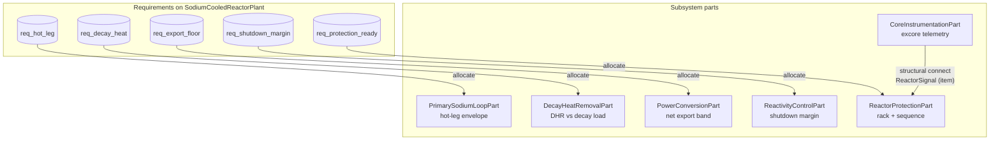

# SFR plant demo — architecture + requirement allocations

Illustrative **sodium-cooled fast reactor** plant slice. Requirements live on **`SodiumCooledReactorPlant`**; **`allocate`** edges show which subsystem owns evidence for each requirement. **`CoreInstrumentationPart`** has no requirement allocation (telemetry path only). See `sodium_fast_reactor_demo.ipynb`.

