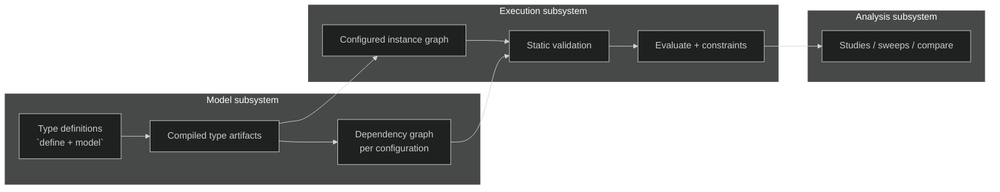

# tg-model Execution Engine Methodology

## Purpose

This document describes **how the execution engine is supposed to work** so that:

- [logical architecture](logical_architecture.md) (subsystems, invariants, flows) has a concrete lifecycle story
- [v0 API](v0_api.md) (`define`, `configure`, `evaluate`, `validate`, studies) has a place to land **without** stuffing implementation detail into the public API doc
- [behavior methodology](behavior_methodology.md) (actions, states, scenarios) can plug into a **single** runtime spine

It is a **methodology** document: vocabulary, phases, responsibilities, and ordering rules. It is not an implementation plan and not a final public API.

## Non-goals

- Exact Python signatures for factories, handles, or backends
- Export schema design
- ThunderGraph persistence or frontend concerns
- Replacing [behavior_methodology.md](behavior_methodology.md) (this doc covers **when** behavioral execution runs relative to structure and values, not the full behavioral ontology)

## Related documents

| Document | Role |
|----------|------|
| [logical_architecture.md](logical_architecture.md) | Subsystem boundaries, hard invariants, primary flows |
| [v0_api.md](v0_api.md) | Public authoring and execution **surface** (directional) |
| [behavior_methodology.md](behavior_methodology.md) | Behavioral primitives, diagrams, execution hierarchy **within** behavior |
| [model_prototype_sketch.py](model_prototype_sketch.py) | Proof of **type-level** structural compilation only (no instances yet) |

## Core vocabulary

### Type definition vs compiled type artifact

- **Type definition:** what the author expresses via `define(cls, model)` (and future companion hooks).
- **Compiled type artifact:** the canonical, inspectable structure the **model** subsystem derives from that definition (the sketch’s `_compiled_definition`-style output: nodes, edges, embedded child type snapshots).

Compiled type artifacts are **not** runtime systems. They are **schemas** keyed by element type.

### Configuration

A **configuration** is a binding of variation points (e.g. `choice` / variant selections) and any other inputs that **change which structural subgraph is active** or **how identities are rooted**.

Per [logical architecture](logical_architecture.md) **Invariant 8**, the **dependency graph is configuration-specific**. Topology-changing configurations may compile **different** graphs; parameter-only studies may **reuse** graph structure when topology is unchanged.

### Configured instance (instance graph)

A **configured instance** is the **materialized** representation of one configuration: slots for parameters and attributes, child instances for nested parts, resolved identities, and links sufficient to resolve values and run constraints.

This is the missing bridge the prototype does not build yet: `DriveSystem._compiled_definition` describes shape; the instance graph holds **values and evaluable state**.

### Definition-time `Ref` vs instance-time handle

- **Definition-time reference (`Ref`):** symbolic pointer produced during `define` (owner type, path, kind, metadata). Used for authoring, validation, and export of intent.
- **Instance-time handle:** stable pointer into the **configured instance** (parameter slot, attribute slot, part instance, port endpoint, etc.) used by `evaluate`, sweeps, and compliance.

The engine must define a **deterministic mapping** from definition paths (+ configuration + identity policy) to instance handles. The public API may expose handles that **mirror** `Ref` paths for ergonomics, but they are not the same object.

### Single run vs study

- **Single run:** one evaluation pass for one configured instance and one input bundle (possibly involving async realization).
- **Study / analysis:** many runs coordinated **outside** single-run resolution, reusing the execution subsystem per run ([logical architecture](logical_architecture.md) Analysis subsystem).

## Runtime data model

This section makes the engine concrete enough to reason about implementation. The names below are **methodology names**, not locked public classes, but the runtime needs equivalents of these concepts.

### 1. `ConfiguredModel`

The root runtime container for **one configured system**.

It owns:

- the root `PartInstance` / `SystemInstance`
- the resolved configuration descriptor
- the instance registry keyed by stable instance id
- the instance-handle registry keyed by canonical instance path
- the configuration-scoped dependency graph
- caches that are valid only for this configured topology

`ConfiguredModel` is **topology-stable** once created. New parameter values may be applied to it across repeated runs. Topology-changing variant changes require a new configured model.

### 2. `ElementInstance`

The generic runtime representation of one materialized semantic element.

Every instance has at least:

- `stable_id`
- `definition_owner_type`
- `definition_path`
- `instance_path`
- `kind`
- `metadata`

Specializations conceptually include:

- `PartInstance`
- `PortInstance`
- `RequirementInstance`
- `ConstraintInstance`
- future behavioral instances (`ActionInstance`, `StateInstance`, `TransitionInstance`, ...)

### 3. `PartInstance`

Represents one materialized `System` or `Part` in the configured graph.

It owns:

- child `PartInstance`s
- `PortInstance`s
- value slots for parameters and attributes
- requirement / allocation bindings relevant to that part scope
- future behavioral state owned by that part

### 4. `PortInstance`

Represents one concrete endpoint under a configured part.

It owns:

- stable identity and path
- direction / interface metadata
- structural connection bindings
- future runtime queues or delivery state when item/event behavior is added

### 5. `ValueSlot`

The runtime cell definition for any parameter or attribute-like quantity.

Methodology clarification: a `ValueSlot` is part of the **configured topology**. It describes **what can hold a value**, not the mutable per-run value state itself.

Each slot must track:

- `stable_id`
- `instance_path`
- declared unit / quantity metadata
- value category (`parameter`, `attribute`, roll-up target, external-computed output, ...)
- dependency-graph handle(s) that realize or check it

This separation matters: a parameter/attribute declaration in the type artifact is **not** itself the mutable runtime location, and the configured `ValueSlot` is **not** the per-run mutable value record either.

### 6. `RunContext`

The per-run mutable state container.

`RunContext` is where actual evaluation state lives for one invocation of `evaluate(...)`, `validate(...)`, or one cell of a sweep.

It owns:

- input bindings for this run
- per-slot run state, keyed by `ValueSlot.stable_id`
- pending async jobs
- realized values
- failure payloads
- provenance for this run
- constraint outcomes for this run
- future behavioral traces for this run

Per-slot run state should track at least:

- `unbound`
- `bound_input`
- `pending`
- `realized`
- `failed`
- `blocked`
- `skipped` (only when optionality is explicit)

Methodology rule: **topology lives on `ConfiguredModel`; mutable values live on `RunContext`.**

That gives the engine a sane reuse boundary:

- one `ConfiguredModel` may support many `RunContext`s
- repeated runs and sweeps do **not** require deep-cloning the configured topology
- concurrent runs over the same topology remain possible if they use isolated `RunContext`s

### 7. `ConnectionBinding`

Represents a resolved structural connection between concrete `PortInstance`s.

It is derived mechanically from definition edges such as:

- `battery.power_out -> motor.power_in`

and stores:

- source handle
- target handle
- carrying metadata
- stable identity/path for export and runtime cross-reference

### 8. `ConstraintBinding`

Represents one instantiated constraint in the configured model.

It stores:

- stable identity
- owning part / element instance
- the callable or compiled constraint body
- references to required input `ValueSlot`s
- latest evaluation outcome and evidence

Constraint bindings are **not** dependency-graph value producers. They are synchronous evaluators over already realized state.

### 9. `ExecutionNode`

One node in the configuration-scoped dependency graph.

The dependency graph should be treated as **bipartite in spirit**:

- **value-side nodes** represent slots or realized assessment values
- **compute-side nodes** represent jobs, expressions, roll-ups, and checks that consume some values and produce other values or assessments

The concrete implementation may encode this as separate classes or tagged node kinds, but the methodology must preserve the distinction. Otherwise multi-input / multi-output computations become muddy and hard to reason about.

Methodology-level node kinds should include at least:

- value-side:
  - `input_parameter`
  - `attribute_value`
  - `rollup_value`
  - `constraint_result`
- compute-side:
  - `local_expression`
  - `external_computation`
  - `rollup_computation`
  - `constraint_check`
- future `behavioral_state_update` / `scenario_expectation`

Not every runtime object needs to become an `ExecutionNode`. For example, `PortInstance` exists structurally even if it never participates in value resolution for a given run.

## Deterministic identity, paths, and handle mapping

The engine needs an exact mapping rule from authored declarations to runtime handles. Without it, `evaluate`, sweeps, export continuity, and traceability all stay fuzzy.

### Definition path

The **definition path** is the lexical path captured during type compilation.

Examples:

- `DriveSystem.battery`
- `DriveSystem.battery.power_out`
- `Motor.torque`

Definition paths are type-scoped and reusable across many configured instances.

### Instance path

The **instance path** is the configured-materialized path from the configured root.

Examples:

- `drive_system.battery`
- `drive_system.battery.power_out`
- `drive_system.motor.torque`

Methodology rule: the instance path should mirror the declaration path names where possible, rooted under the configured root identity.

### Stable instance id

The runtime stable id should be derived deterministically from:

- configured root identity
- configuration discriminator (only when the topology choice matters)
- instance path
- explicit authored id overrides when present

Illustrative formula:

`stable_id = deterministic_uuid(root_identity, configuration_fingerprint, instance_path, explicit_id_override?)`

The exact UUID/hash function is not fixed here. The important point is that:

- identical structure + identical configuration + identical naming -> identical ids
- topology-changing variant changes -> different ids where the instance graph genuinely differs
- regenerated code that preserves declaration identity should preserve ids

Methodology choice: in the absence of explicit authored ids, **structural equality implies identity equality**.

That means:

- deleting and recreating the “same” declaration with the same path and same configuration context yields the same deterministic id
- continuity is anchored to modeled structure, not to the historical fact that some object once existed in memory

This is an intentional choice for code-authored MBSE, not an accidental side effect.

### Public handle mapping

Methodology rule: a public handle used by `evaluate`, `sweep`, or `impact` must be reducible to an **instance path** or **stable instance id**.

That means the engine should maintain two internal registries:

- `path -> handle`
- `stable_id -> handle`

This allows:

- ergonomic user access (`drive.battery.voltage`)
- stable persistence/export/traceability keyed by id
- internal graph compilation keyed by canonical handles rather than ad hoc strings

## Lifecycle overview

End-to-end flow (aligned with **Primary Flows** in [logical_architecture](logical_architecture.md)):

1. **Compile types** — derive compiled type artifacts from definitions.
2. **Resolve configuration** — choose variants; lock active structure for this instance.
3. **Instantiate** — build the configured instance graph and instance identities.
4. **Compile dependency graph (configuration-scoped)** — model + execution planning produce the pre-execution dependency graph for **this** configuration.
5. **Static validation** — fail before expensive or async work if the configuration is not evaluable.
6. **Evaluate** — resolve values (local expressions + async computed realization), then run constraints / compliance over realized state.
7. **Behavioral steps (when in scope)** — scenario execution / validation per [behavior methodology](behavior_methodology.md), using the same instance spine and deterministic ordering rules.
8. **Studies** — repeat evaluation under isolated configurations or input grids; stream results ([logical architecture](logical_architecture.md) Flow 3).

## Phase 1 — Type definition compilation (model)

**Input:** authored element types (`System`, `Part`, …) and their `define` implementations.

**Output:** compiled type artifacts per type: declared nodes, relationship edges, embedded child type definitions, and stable declaration paths.

**Responsibilities:**

- Record declarations in a **framework-controlled** context (validated for structure in the prototype).
- Recurse into referenced part types so nested `Ref` resolution is type-aware.
- Emit a representation suitable for **export of definitional graphs** and for **later instantiation**.

**Does not yet include:** parameter values, variant resolution, or dependency edges for computed attributes (those appear after configuration is known or after full definition compilation rules are extended).

## Phase 2 — Configuration resolution

**Input:** a root element type + **configuration arguments** (variant choices, optional explicit ids, future: reconfiguration hooks).

**Output:** a resolved **configuration descriptor**: which structural branches are active, consistent naming roots, and enough information to instantiate **exactly one** shaped instance graph.

**Rules:**

- **Topology must be known** before building the dependency graph for that instance ([logical architecture](logical_architecture.md) Invariant 8).
- If two configurations differ in **active parts or relationships**, treat them as **different** instance shapes for graph compilation and validation.
- If only **parameter values** change, reuse compiled dependency **structure** when the implementation can prove topology is unchanged (same architecture doc: compilation reuse direction).

### Configuration resolution algorithm

For one requested root type:

1. Start from the compiled root type artifact.
2. Collect all declared variation points reachable from the root.
3. Merge user-supplied selections with any explicit defaults.
4. Fail if any required variation point remains unresolved.
5. Compute the **active structural subgraph** for this selection set.
6. Produce a **configuration fingerprint** that is stable for structurally equivalent selections.
7. Freeze the result into a configuration descriptor. No topology-changing edits occur after this point.

This descriptor is an engine object, not necessarily the public return type of `configure(...)`.

### v0 configuration rule

For v0, configuration resolution should stay deliberately simple:

- treat variant selection as **top-down structural selection**
- do **not** treat v0 configuration as a general SAT / CSP solver
- do **not** infer hidden selections from global optimization logic

If a parent variation point selects `battery`, the engine activates the `battery` branch and recursively continues through the declarations reachable from that branch. If a later version needs richer cross-configuration constraint solving, that should be added consciously rather than smuggled into v0.

## Phase 3 — Instantiation (configured instance graph)

**Input:** compiled type artifacts + configuration descriptor.

**Output:** a **configured instance graph**: objects or slots that hold:

- **Child instances** for each active `part` under the parent instance
- **Ports** as typed endpoints (even if v0 treats them primarily as structural connectors before behavioral I/O is fully wired)
- **Parameters** as externally settable inputs (sweepable)
- **Attributes** as stateful or derived slots (including those with `computed_by`)
- **Stable instance identity** per node (path + configuration scope + explicit id overrides per [logical_architecture](logical_architecture.md) Model identity direction)

**Methodological constraints:**

- Instantiation is **mechanical**: walk the compiled artifact for the **active** subgraph; do not invent undeclared children.
- **Strict completeness** ([logical_architecture](logical_architecture.md) Invariant 9): missing required structure is a **model/configuration failure**, not a silent default.
- The public API may expose `drive.battery` **if** the framework assigns attributes during instantiation; alternatively it may expose `instance.part("battery")`. The methodology only requires a **deterministic** navigation story from declaration path to instance slot.

### Instantiation algorithm

This is the concrete bridge missing from the current prototype.

For a resolved configuration descriptor:

1. Create a `ConfiguredModel` root container.
2. Create the root `PartInstance` / `SystemInstance`.
3. Walk the active compiled type artifact depth-first or breadth-first. The traversal order must be deterministic.
4. For each declared `part` node:
   - create a child `PartInstance`
   - assign `instance_path`
   - derive `stable_id`
   - attach it to the parent
   - register it in the root registries
5. For each declared `port` node:
   - create a `PortInstance`
   - attach it under the owning part instance
   - register it
6. For each declared `parameter` or `attribute`:
   - create a `ValueSlot`
   - mark parameters as externally bindable
   - mark attributes as unresolved until realization
7. For each requirement or allocation declaration:
   - create the corresponding runtime binding object
   - register ownership and traceability links
8. For each structural edge such as `connect`:
   - resolve source/target `PortInstance`s through the instance-handle registry
   - create a `ConnectionBinding`
9. Freeze topology. After this step, repeated evaluations create new `RunContext`s and update run-scoped state there; they do not add/remove elements from the configured model.

### Public access shape

The methodology allows two equivalent access styles:

- attribute projection: `drive.battery.voltage`
- explicit lookup: `drive.part("battery").slot("voltage")`

The engine requirement is not which spelling wins. The requirement is:

- the projection is deterministic
- the projection is rooted in the same handle registry used by evaluation
- projected attributes do not bypass stable identity or configuration scope

## Phase 4 — Dependency graph compilation (configuration-scoped)

**Input:** configured instance graph + full definition semantics (attributes, constraints, computed bindings, roll-ups as they exist for that version).

**Output:** a **precompiled dependency graph** for that configuration: nodes for evaluable quantities, edges for “must resolve before,” plus metadata for external jobs.

**Responsibilities (model + execution planning):**

- Include **roll-ups and budgets** as first-class dependencies (not analysis-only), consistent with [v0_api](v0_api.md) and architecture.
- Encode **unitflow** dimensional constraints as static checks where possible ([logical architecture](logical_architecture.md) Invariant 10).
- Support **pruning** to the subgraph needed for a given `evaluate` or `validate` request (execution owns pruning; model owns the full precompiled graph for the configuration).

### Dependency node kinds

The configuration-scoped dependency graph should distinguish at least:

- **Value nodes** — externally supplied parameters, attribute values, roll-up results, constraint results
- **Compute nodes** — local expressions, external jobs, roll-up computations, synchronous checks
- **Scenario / behavior nodes** — optional v0+ extension, only when behavioral execution is in scope

### Dependency edge semantics

An edge `A -> B` means:

- `B` cannot be evaluated until `A` is in a terminal success state, or
- `B` must fail/skip according to policy if `A` enters a terminal failure state

Illustrative examples:

- parameter `shaft_speed` -> derived attribute `shaft_power`
- child attribute `left_wing.mass` -> roll-up `aircraft.total_mass`
- attribute `operating_temp` -> constraint `thermal_check`
- external computed input `power_in` -> adapter job output `operating_temp`

In a bipartite reading, the more precise forms are:

- `shaft_speed` (value) -> `shaft_power_expression` (compute) -> `shaft_power` (value)
- `left_wing.mass` (value) -> `total_mass_rollup` (compute) -> `aircraft.total_mass` (value)
- `power_in` (value) -> `thermal_job` (compute) -> `operating_temp` (value)
- `operating_temp` (value) + `max_temp` (value) -> `thermal_check` (compute) -> `thermal_check_result` (value)

### Graph compilation algorithm

For each configured instance:

1. Create graph nodes for externally bindable parameters.
2. Create graph value nodes for attributes that participate in evaluation.
3. Create compute nodes for local expressions and connect their input value nodes and output value nodes.
4. Expand roll-up declarations into compute nodes whose inbound edges come from selected child value slots and whose outbound edge targets the aggregate value slot.
5. Create external computation nodes for any `computed_by` bindings and connect all required input value nodes and all declared output value nodes.
6. Create constraint compute nodes whose inbound edges are the value slots they read and whose outbound edge is a constraint-result value node.
7. Validate acyclicity for the requested evaluation scope.
8. Persist the graph on the configured model for reuse across parameter-only runs.

Constraint nodes belong in the graph for planning and ordering, but they do not produce new engineering values. Their output is an assessment result.

## Phase 5 — Pre-execution static validation

**Input:** configuration-scoped dependency graph + schema of required inputs.

**Output:** pass/fail + structured diagnostics.

Must fail fast on ([logical_architecture](logical_architecture.md) Invariant 10):

- broken references
- missing required children or attributes
- dependency cycles in the evaluable subgraph
- dimensional incompatibility in declared expressions
- incomplete configuration (unselected `choice`, etc.)

**Rule:** no long-running async work or external jobs until this phase succeeds for the requested evaluation scope.

### Validation categories

Validation should report failures in structured categories, not one generic “invalid model” blob.

Recommended categories:

- **Configuration errors** — unresolved variants, invalid variant names, illegal configuration combinations
- **Instantiation errors** — missing required child, duplicate stable identity, unresolved instance handle
- **Reference errors** — declaration path or handle points to the wrong kind or a missing element
- **Dependency errors** — cycle, missing upstream node, invalid roll-up expansion
- **Dimensional errors** — `unitflow` incompatibility
- **Execution-contract errors** — missing required backend binding for a `computed_by` node

Methodology rule: static validation should return enough structured evidence to let the user fix the model without starting evaluation.

## Phase 6 — Single-run evaluation

**Input:** validated configured instance + input bundle + optional backend/adapters.

**Output:** realized values on attribute/parameter slots + constraint/compliance results (+ optional trace records for behavior when applicable).

**Ordering:**

- Execute according to the **pruned dependency graph** in a **deterministic** order for identical inputs ([logical_architecture](logical_architecture.md) Execution subsystem).
- **Async** is allowed **inside** resolution of computed attributes and integration calls ([logical_architecture](logical_architecture.md) Invariant 6); dependent nodes **wait** for required upstream completion ([logical_architecture](logical_architecture.md) Execution posture).
- **Constraints** run **synchronously** over realized values ([logical_architecture](logical_architecture.md) Invariant 5).

**API alignment ([v0_api](v0_api.md)):**

- `evaluate` — materialize requested state.
- `validate` — compliance over realized values (whether it always implies full `evaluate` is a product decision; methodology allows either if semantics are explicit).
- `compile` — explicit “prepare configuration + dependency graph + validation cache” step if exposed publicly.

### Evaluation run model

The engine should behave like a deterministic scheduler over the pruned dependency graph.

#### Per-run phases

1. Create a fresh `RunContext` for this invocation, reusing the configured topology and compiled graph.
2. Bind external input values into parameter `ValueSlot`s by writing run-scoped state into the `RunContext`.
3. Mark all ready nodes whose dependencies are satisfied.
4. Repeatedly drain the ready set:
   - execute pure compute nodes immediately
   - submit external computation nodes to adapters/backends
   - mark async run-scoped state as `pending`
5. When async nodes complete:
   - materialize results into target slot state inside the `RunContext`
   - transition dependent nodes into ready if all prerequisites succeeded
6. If a required upstream node fails:
   - mark dependent required nodes as failed or blocked according to strict-completeness policy
   - abort the run if the failure makes requested outputs impossible
7. After all requested value nodes reach terminal states in the `RunContext`, evaluate constraint nodes synchronously.
8. Materialize the final run result object.

#### Terminal node states

Run-scoped node state should end in one of:

- `realized`
- `failed`
- `blocked`
- `skipped` (only for explicitly optional semantics, not implicit absence)

#### Failure propagation

Methodology rule:

- required upstream failure propagates to required dependents
- optional branches may resolve to `skipped`, but optionality must be modeled explicitly
- external backend timeout/cancellation is a first-class failure, not silent `None`

### Run result shape

Even if the final public class names differ, one run result should be able to expose:

- realized outputs by handle and by path
- constraint outcomes
- failure diagnostics
- provenance for externally computed values
- future behavioral traces when behavior execution is requested

Methodology rule: the run result is derived from the `RunContext`; it is not the configured model itself.

## Phase 7 — Behavioral execution (scenarios, state machines)

**Scope boundary:** structural instantiation and **value** resolution (Phases 3–6) provide the **spine** on which behavioral execution runs.

**Behavior-specific rules** (detail in [behavior_methodology](behavior_methodology.md)):

- Discrete logical time for v0; deterministic **execution hierarchy** for events, transitions, guards, actions.
- **Scenarios** are authored contracts; **traces** are runtime records — same separation as in behavior doc.

**Methodological placement:** behavioral steps **consume** instance state and port/item semantics; they do not redefine structural identity or dependency compilation.

### Runtime integration rule

Behavior must not create a second disconnected world of runtime objects.

Instead:

- behavior references existing `PartInstance`, `PortInstance`, and `ValueSlot` objects
- behavioral events may read/write the same slots used by value evaluation where the model allows it
- scenario execution emits trace records keyed by the same stable ids used elsewhere in the configured model

This keeps state diagrams, sequence traces, and structural/value evaluation aligned.

## Phase 8 — Analysis and studies

The **analysis** subsystem ([logical_architecture](logical_architecture.md)) orchestrates:

- multiple configured instances (e.g. variants)
- input grids for sweeps
- streaming results to sinks

Each cell of a study is still **one single-run evaluation** through the execution subsystem. Analysis must not fork a second, incompatible resolution engine.

### Reuse and isolation rules

To make sweeps and comparisons efficient without losing determinism:

- **May reuse:**
  - compiled type artifacts
  - configuration descriptors for structurally identical selections
  - configured-model topology when only input parameters change
  - dependency graphs for the same configured topology
- **Must isolate:**
  - `RunContext`s
  - run-scoped realized values
  - run-scoped failures
  - behavioral traces
  - backend job handles and transient adapter state
- **Must rebuild when topology changes:**
  - instance graph
  - handle registry
  - configuration-scoped dependency graph

This gives sweeps a clear optimization boundary: reuse structure, isolate run state.

## Design principles (checklist)

- **Separation:** definition (`define`) ≠ configuration ≠ instance ≠ run.
- **Configuration-scoped graphs:** dependency structure follows **locked** topology for that instance.
- **Determinism:** same configuration + same inputs → same resolution order and same outcomes (modulo explicit non-deterministic backends, which must be labeled as such in integration contracts).
- **Fail fast:** static validation before async; strict completeness by default.
- **unitflow-first:** quantities and dimensions are part of validation and evaluation, not an afterthought.

## Open questions (to drive next iterations)

- Exact **factory API**: `RootType(configuration)` vs `configure(RootType, ...)` vs builder — must not blur configuration and instance.
- Which runtime concepts become public Python classes versus internal machinery (`ValueSlot`, handles, run result objects).
- **Handle** surface for sweeps: mirror `Ref` paths, opaque ids, or both.
- Whether attribute projection (`drive.battery.voltage`) is the primary public ergonomics or just sugar over explicit lookups.
- When **roll-up** and **computed_by** declarations join the same `define` pipeline as structure, how much of the dependency graph is incremental vs full recompile on definition change.
- How **behavioral** nodes attach to `model` without unreadable wiring; may require named intermediates or small internal DSL sugar.
- Interaction between **scenario validation** and **constraint validation** (one report vs layered reports).

## Summary

The **engine** is not a single loop; it is a **pipeline**: compile types → resolve configuration → instantiate → compile dependency graph for that configuration → validate → evaluate (with async resolution where allowed) → optional behavioral execution → studies layered on top. Keeping these phases explicit preserves alignment with [logical_architecture.md](logical_architecture.md), explains how [v0_api.md](v0_api.md) hangs together, and leaves room to refine the public API without redrawing the whole architecture.
