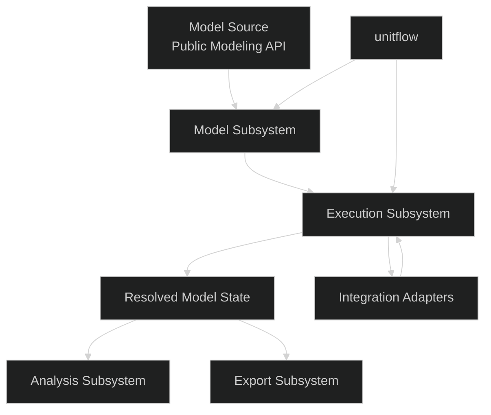

# tg-model Logical Architecture

## Purpose

This document defines the v0 logical architecture for `tg-model`.

It is intentionally narrow. Its purpose is to capture the architectural decisions that should remain stable while the API design and execution model continue to iterate.

This is not a final architecture.
This is not an implementation plan.
This is an architectural anchor for iterative design.

## Table of Contents

- [Scope](#scope)
- [Architecture Goals](#architecture-goals)
- [Hard Invariants](#hard-invariants)
- [Layered View](#layered-view)
- [Logical Subsystems](#logical-subsystems)
- [Primary Flows](#primary-flows)
- [Architecture Boundaries](#architecture-boundaries)
- [File Tree Direction](#file-tree-direction)
- [Open Questions](#open-questions)
- [Iteration Strategy](#iteration-strategy)

**Related methodology:** [execution_methodology.md](execution_methodology.md) — execution lifecycle (definition → configuration → instance → graph → validate → evaluate) that implements this architecture’s flows without duplicating subsystem boundaries here.

## Scope

This architecture covers `tg-model` as a standalone library.

It addresses:

- modeling semantics
- evaluation semantics
- subsystem boundaries
- async execution boundaries
- external analysis boundaries
- graph export boundaries

It explicitly does not address:

- ThunderGraph application architecture
- proprietary persistence architecture
- frontend architecture
- deployment and networking architecture
- sandboxing and product security architecture

## Architecture Goals

The architecture should:

- preserve the useful concepts of SysML while avoiding SysML tooling fragility
- keep `unitflow` as a foundational math substrate
- support LLM-first declarative model authoring
- remain readable and editable for power users
- separate model declaration from execution
- separate structural semantics from external solver implementation
- support stable semantic identity across regenerations
- support graph export without making graph storage the source of truth

## Hard Invariants

These are the architectural rules that should remain stable unless there is a very strong reason to change them.

### 1. Library Boundary

`tg-model` is a library, not the full product.

It owns:

- the modeling DSL
- the semantic model
- evaluation and validation orchestration
- graph projection
- extension points for external analysis

It does not own:

- proprietary persistence
- collaboration features
- product orchestration
- frontend rendering

### 2. Source Of Truth

The source of truth is:

- Python model code
- the in-memory semantic object graph derived from that code

Derived artifacts include:

- graph exports
- validation outcomes
- simulation traces
- sweep datasets
- reports and visualizations

### 3. UnitFlow Is Foundational

`unitflow` is not optional convenience infrastructure.

It is the engineering math substrate for:

- units
- quantities
- dimensional semantics
- symbolic engineering expressions

`tg-model` owns system semantics on top of that foundation.

### 4. Stable Identity Is Mandatory

Every semantic element must have a stable deterministic identity.

This is required for:

- regeneration tolerance
- traceability continuity
- graph export continuity
- subgraph replacement without semantic collapse

Ephemeral in-memory object identity is insufficient.

Chosen direction:

- allow explicit authored identifiers when needed
- otherwise derive identity deterministically from namespace and ownership path

### 5. Constraints Are Pure Over Realized Values

Constraints operate synchronously over realized values.

Constraints do not own async orchestration.
Constraints do not directly manage external execution.

### 6. Async Lives In Resolution, Not Authoring Logic

Async behavior is allowed in:

- computed attribute realization
- external analysis orchestration
- evaluation engine internals

Async behavior should not leak into the declarative modeling DSL as the primary authoring mode.

### 7. The Model Owns A Precompiled Dependency Graph

The model subsystem must compile dependency metadata into a dependency graph before execution begins.

This is required for:

- cycle detection before runtime resolution
- deterministic execution planning
- clear separation between model construction and runtime orchestration

The execution subsystem may prune the graph for a specific run, but it should not discover the core dependency structure from scratch at runtime.

### 8. Dependency Graphs Are Configuration-Specific

The dependency graph is not a property of abstract type definitions alone.

It is a property of a specific instantiated model configuration, including:

- ownership paths
- bound variants
- selected architectural alternatives
- declared computed attributes

If two configurations differ structurally, they may legitimately compile to different dependency graphs.

Compilation reuse direction:

- topology-changing configurations compile distinct dependency graphs
- parameter-only runs may reuse compiled dependency structure and rerun value resolution against new inputs

### 9. Strict Completeness Is The Default

The default execution posture is strict completeness.

This means:

- required structural elements must exist before evaluation
- required dependencies must resolve before dependent evaluation proceeds
- unresolved required values are execution failures
- missing required children are model failures
- silent degradation or implicit defaulting is not the default behavior

If optionality is supported, it must be modeled explicitly rather than inferred from absence.

### 10. Pre-Execution Static Validation Is Mandatory

Before runtime evaluation begins, the library must validate that the instantiated configuration is structurally and semantically evaluable.

This validation should fail fast on issues such as:

- missing required children
- missing required attributes
- broken references
- dependency cycles
- dimensionally incompatible declared expressions

This validation exists to prevent long-running evaluation or external analysis work from starting on an invalid model configuration.

### 11. Heavy Physics Remains External

`tg-model` may orchestrate external simulation or metamodel tools.

It should not assume responsibility for becoming a general-purpose large-scale continuous-physics or ODE-solving environment.

## Layered View



## Logical Subsystems

## 1. Model

Responsibilities:

- provide the public modeling API
- express system structure and relationships
- express requirements, attributes, and constraints
- maintain stable identity and semantic ownership
- hold the canonical semantic representation of the modeled system
- compile dependency metadata into a pre-execution dependency graph
- support configuration-specific instantiation, including variant selection

Examples of concepts owned here include:

- `System`
- `Part`
- `Requirement`
- `Interface`
- `Port`
- `Attribute`
- `Constraint`
- relationship declarations

This subsystem is the home of both:

- the author-facing modeling surface
- the core model objects and semantic identities needed by the rest of the library

This subsystem should optimize for clarity, low ambiguity, and semantic stability.

It also owns the precompiled dependency graph because dependency structure is part of the model definition, not an accidental byproduct of runtime evaluation.

Identity direction:

- declaration-time descriptors capture authored names on containing types
- instantiation-time context establishes ownership paths and configuration scope
- explicit authored identifiers override the default path-derived identity when present

This means stable identity is not bolted on after object creation. It is part of how model elements are declared and instantiated.

## 2. Execution

**Methodology:** the ordered phases (instantiation, configuration-scoped dependency compilation, static validation, single-run resolution, constraints) are described in [execution_methodology.md](execution_methodology.md). This section remains the **boundary** definition; that document is the **operational** story.

Responsibilities:

- resolve the modeled system into executable form
- statically validate evaluability before runtime execution begins
- execute a single evaluation run for a specific instantiated configuration
- resolve local expressions
- orchestrate external computations where needed
- materialize realized values
- enforce execution isolation
- preserve deterministic behavior for identical inputs and results
- evaluate constraints and compliance over realized values
- prune the precompiled dependency graph to the subgraph needed for a specific run

This subsystem owns the runtime methodology.

It consumes the dependency graph compiled by the model subsystem rather than inventing dependency structure from scratch during execution.

Execution posture:

- fail fast on invalid or incomplete required structure
- wait for required async values before continuing dependent evaluation
- abort the run if required upstream realization fails

## 3. Analysis

Responsibilities:

- define and coordinate multi-run workflows
- support architectural variant comparison workflows
- support impact analysis queries
- coordinate result streaming to sinks or collectors

This subsystem does not own single-run value resolution.

This subsystem should reuse the execution subsystem rather than inventing a second execution path.

Roll-ups and budget calculations are not analysis-only features. They are core model semantics evaluated by the execution subsystem. The analysis subsystem may organize or compare roll-up results across studies, but it should not own the underlying roll-up computation model.

Variant direction:

- analysis may compare multiple variants
- each variant is evaluated as an independent instantiated configuration
- each instantiated configuration may compile its own dependency graph
- the analysis layer compares results across those independent execution paths rather than forcing one global mixed graph

## 4. Integrations

Responsibilities:

- connect external solvers, simulations, and metamodel tools
- hide backend-specific job submission and polling details
- materialize returned outputs into model values

This subsystem is the boundary between `tg-model` and specialized external tools.

## 5. Export

Responsibilities:

- project the semantic model into a stable exportable graph representation
- preserve stable identifiers
- include relevant engineering semantics where appropriate
- include metadata indicating the graph kind being exported

This subsystem exists for downstream consumers.
It must not redefine the semantic core.

Chosen direction:

- use one core export schema
- distinguish definitional, architectural, and evaluated-state views using graph-kind metadata rather than entirely separate export architectures at this stage

## Primary Flows

## Flow 1: Structural Model Creation

1. Model source is authored through the public modeling API.
2. The model subsystem constructs the canonical semantic representation.
3. Stable identities are assigned or resolved.
4. A concrete model configuration is instantiated.
5. A dependency graph is compiled for that specific configuration.
6. The model becomes available for execution, analysis, and export.

## Flow 2: Value Resolution And Compliance Evaluation

1. An evaluation request is made.
2. The execution subsystem validates that the instantiated configuration is structurally and semantically evaluable.
3. The execution subsystem selects the relevant portion of the precompiled dependency graph.
4. The execution subsystem resolves local values.
5. The execution subsystem orchestrates external analyses where needed.
6. Realized values are materialized into the model state.
7. Constraints and compliance checks execute over realized values.
8. Outcomes are returned.

## Flow 3: Parametric Or Variant Study

1. A study definition is created.
2. The analysis subsystem creates isolated configurations and defines the multi-run workflow.
3. Each configuration compiles or selects its dependency graph.
4. The execution subsystem performs each individual run.
5. Results are streamed to a sink or collector.
6. The analysis subsystem organizes comparison across the resulting runs.
7. Downstream tools compare or inspect the study outcomes.

## Flow 4: Graph Projection

1. The semantic model is selected for export.
2. Stable identities and relationships are projected.
3. A graph representation is emitted for downstream systems.

## Architecture Boundaries

## What Belongs In The Semantic Core

- system structure
- semantic relationships
- requirements and allocations
- dependency relationships
- roll-up definitions and budget semantics
- configuration and variant bindings
- compliance semantics
- stable identity

## What Belongs In The Execution Layer

- pre-execution static validation
- single-run execution
- evaluation planning
- computed attribute realization
- async orchestration
- result streaming

## What Belongs Outside The Library

- large-scale physics engine internals
- persistent graph database concerns
- frontend concerns
- product-specific workflows

## File Tree Direction

This is a logical direction, not a final package commitment.

```text
tg_model/
├── model/         # public modeling API + core model objects
├── execution/     # runtime evaluation API + engine
├── analysis/      # sweeps, roll-ups, impact analysis
├── integrations/  # external backend adapters
├── export/        # graph export
└── docs/          # architecture, requirements, use cases, API docs
```

Clarification:

- `model/` owns the public modeling API, stable identity, and the precompiled dependency graph
- `execution/` owns pre-execution validation, single-run resolution, orchestration, and compliance evaluation
- `analysis/` owns multi-run and comparison workflows such as sweeps, variants, and impact-analysis queries
- roll-up computation itself belongs to `model/` plus `execution`, even if `analysis/` reports on roll-up results
- dependency graphs are compiled per instantiated configuration, not assumed to be globally static across all variants
- parameter-only runs may reuse compiled dependency structure when topology and configuration shape remain unchanged

## Open Questions

These are intentionally deferred to the next architecture/API iteration.

- What is the exact public distinction between `parameter(...)` and `attribute(...)`?
- How should architectural variants be represented in the DSL?
- How should requirement allocations be authored across system, variant, and configuration contexts?
- How much discrete behavioral semantics belongs in v0?
- What is the exact result sink interface for studies?
- What is the exact adapter interface for external analysis backends?
- How should recursive roll-up declarations be represented before compilation into explicit execution dependencies?
- What export shape should be standardized later once the core model and execution semantics stabilize?

## Iteration Strategy

This architecture should evolve through short iterations.

Recommended loop:

1. refine architecture invariants
2. sketch API examples
3. walk those examples through the execution model ([execution_methodology.md](execution_methodology.md))
4. update architecture only where contradictions are exposed

This document should stay small and stable.

If it starts absorbing API details, backend implementation details, or product-specific concerns, it is doing too much.
